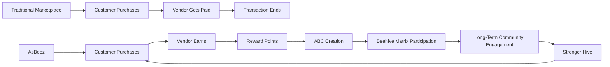
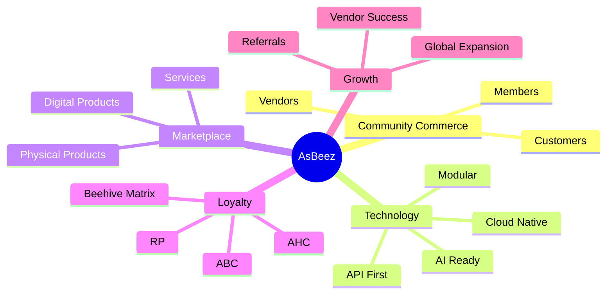

# Competitive Advantage

---

## Document Information

**Document ID:** AEDS-B02-006

**Version:** 1.0.0

**Status:** Draft

**Book:** 02 – The Business

**Classification:** Strategic Layer

**Owner:** Creator, Founder & Chief Architect

**Author:** Joey Lustre

---

# Purpose

This document defines the strategic advantages that differentiate AsBeez from traditional e-commerce platforms and marketplaces.

Competitive advantage is not about claiming superiority.

It is about clearly understanding what unique value AsBeez delivers that is difficult for competitors to replicate.

---

# Business Philosophy

Most marketplaces are designed around transactions.

AsBeez is designed around relationships.

Traditional marketplaces optimize for:

• More products

• Faster shipping

• Lower prices

• Better logistics

AsBeez also values these objectives.

However, our long-term strategy focuses on something much deeper:

Building an ecosystem where customers, vendors, and members all benefit from genuine marketplace growth.

---

# Our Primary Competitive Advantage

> **Community Commerce**

AsBeez is not simply another online marketplace.

It is a Community Commerce Platform.

Community Commerce combines:

- E-Commerce
- Vendor Empowerment
- Customer Loyalty
- Marketplace Technology
- Community Participation
- Long-Term Relationship Building

into one integrated ecosystem.

This creates value beyond the transaction itself.

---

# Competitive Positioning Diagram

---

# The AsBeez Difference

Traditional marketplaces focus primarily on connecting buyers and sellers.

AsBeez expands that relationship by encouraging long-term participation.

Customers become Members.

Members may become Vendors.

Vendors become long-term partners.

The ecosystem continuously grows through genuine commerce.

---

# Vendor Competitive Advantage

Traditional marketplaces provide visibility.

AsBeez provides visibility plus community.

Vendor Benefits include:

• Individual Storefront

• Analytics

• Coupons

• Promotions

• Digital Delivery

• Future AI Tools

• Loyal Customer Ecosystem

• International Expansion

• Revenue Sharing Configuration

The objective is not only to generate sales.

It is to build long-term vendor success.

---

# Customer Competitive Advantage

Customers receive:

• Competitive products

• Digital convenience

• Secure shopping

• Vendor diversity

• Long-term loyalty participation

• Future wallet ecosystem

• Unified marketplace experience

AsBeez seeks to reward long-term engagement rather than isolated purchases.

---

# Member Competitive Advantage

Members enjoy benefits beyond those of standard customers.

Examples include:

• Reward Point accumulation

• ABC creation

• Participation in the Beehive Matrix according to platform rules

• Referral opportunities

• Wallet functionality

• Long-term ecosystem participation

Membership is free.

Participation grows naturally through genuine commerce.

---

# Vendor Acquisition Advantage

Most marketplaces require vendors to spend continuously on advertising.

AsBeez seeks to help vendors build repeat business through a stronger loyalty ecosystem.

Vendor retention becomes one of the marketplace's greatest assets.

---

# Technology Advantage

The platform is being designed as an enterprise system from its inception.

Key characteristics include:

Cloud Native

AI Ready

API First

Country Localization

Configuration Driven

Highly Scalable

Modular Architecture

Enterprise Security

Business Rule Engine

Marketplace Analytics

This enables AsBeez to evolve without major redesign.

---

# Business Architecture Advantage

Unlike many startups that add features as they grow, AsBeez is being designed using enterprise architecture principles before development.

The platform will be organized into business domains including:

Identity

Membership

Vendor

Catalog

Commerce

Rewards

Beehive Matrix

Financial

Operations

Platform

This architecture improves maintainability, scalability, and long-term adaptability.

---

# Global Expansion Advantage

The ecosystem is designed for international growth.

Country-specific marketplaces can operate independently while sharing a common technology platform.

Examples:

AsBeez USA

AsBeez Canada

AsBeez Philippines

Future countries can be added without redesigning the platform.

---

# The Network Effect

The more Vendors join...

↓

The more Products become available...

↓

The more Customers purchase...

↓

The more Members participate...

↓

The stronger the Hive becomes...

↓

The more attractive AsBeez becomes to new Vendors...

↓

The cycle repeats.

This creates a self-reinforcing ecosystem.

---

# Competitive Moat

The long-term competitive moat of AsBeez is expected to come from the combination of:

• Brand Trust

• Community Loyalty

• Vendor Relationships

• Enterprise Technology

• Configurable Platform

• Beehive Ecosystem

• Global Marketplace

• Continuous Innovation

While competitors may copy individual features, replicating the entire ecosystem becomes significantly more difficult as the platform matures.

---

# Comparison Matrix

| Capability | Traditional Marketplace | AsBeez |
|------------|------------------------|---------|
| Multi-Vendor Marketplace | ✅ | ✅ |
| Individual Storefronts | ✅ | ✅ |
| Digital Products | ✅ | ✅ |
| Services Marketplace | Some | ✅ |
| Physical Products | ✅ | Planned |
| Community Commerce | ❌ | ✅ |
| Vendor Revenue Sharing | Limited | ✅ |
| Loyalty Ecosystem | Basic | Advanced |
| Configurable Business Rules | Limited | ✅ |
| Enterprise Architecture | Varies | ✅ |
| Country-Specific Platforms | Limited | ✅ |
| Community Growth Philosophy | ❌ | ✅ |

> **Note:** This comparison is conceptual and reflects AsBeez's intended business model. Individual competitors may offer similar features in different ways.

---

# Business Risks

Competitive advantages must continually evolve.

Potential risks include:

- Competitors introducing similar loyalty features.
- Vendors resisting revenue-sharing.
- Customer education challenges.
- Regulatory changes affecting rewards.
- Rapid changes in technology.
- International compliance requirements.

AsBeez should continuously innovate while remaining true to its constitutional principles.

---

# Success Metrics

Competitive strength may be measured through:

- Vendor Growth Rate
- Customer Retention
- Member Activation
- Repeat Purchase Rate
- Vendor Lifetime Value
- Marketplace GMV
- Net Promoter Score (NPS)
- Trust Score
- International Expansion
- Platform Availability

---

# Summary

AsBeez is not attempting to become another Amazon.

It is creating a new category of commerce.

By combining a trusted marketplace with long-term loyalty, vendor empowerment, enterprise technology, and community participation, AsBeez seeks to redefine how people experience online commerce.

The company's greatest competitive advantage is not a single feature.

It is the integration of multiple systems into one cohesive ecosystem designed to strengthen the Hive through genuine commerce.

---

# Competitive Advantage Diagram

---

# Related Documents

- AEDS-B02-002 – Business Overview
- AEDS-B02-003 – Business Model
- AEDS-B02-004 – The AsBeez Ecosystem
- AEDS-B02-005 – Stakeholders
- AEDS-B02-007 – Business Flywheel

---

# Revision History

| Version | Date | Description | Author |
|----------|------|-------------|--------|
| 1.0.0 | 2026-07-07 | Initial Competitive Advantage | Joey Lustre |

---

> **Every Purchase Builds the Hive.**
