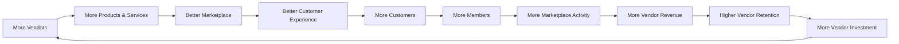
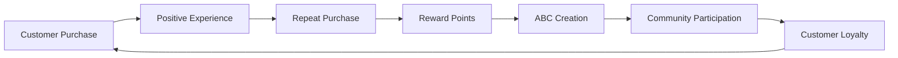
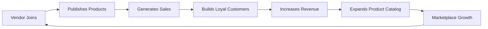
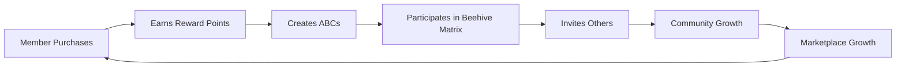
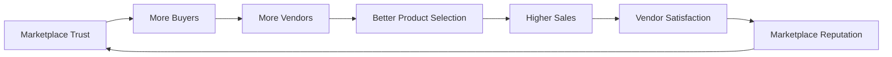
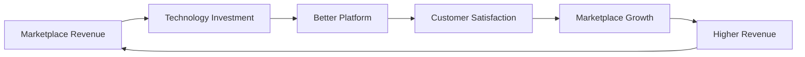
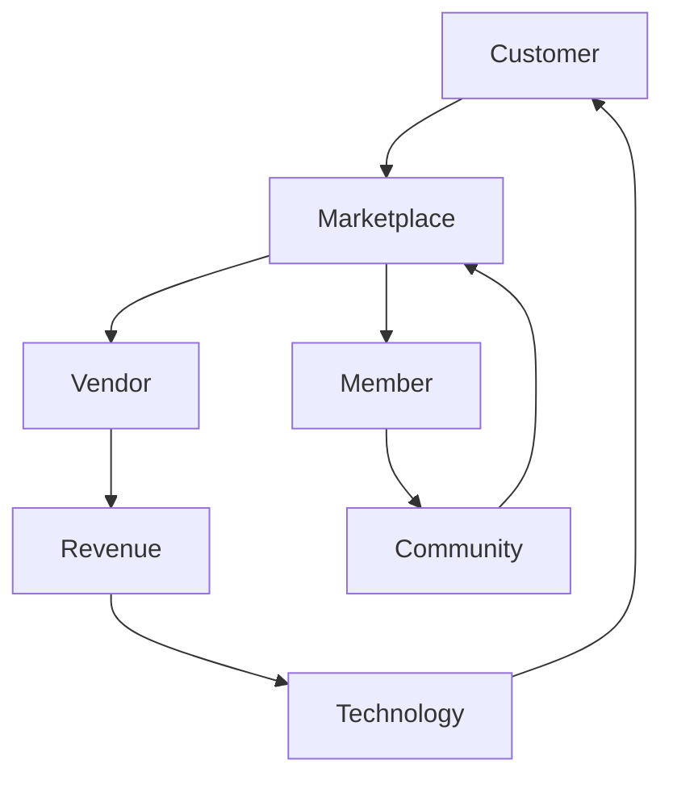

# The AsBeez Hive Flywheel

---

## Document Information

**Document ID:** AEDS-B02-007

**Version:** 1.0.0

**Status:** Draft

**Book:** 02 – The Business

**Classification:** Strategic Layer

**Owner:** Creator, Founder & Chief Architect

**Author:** Joey Lustre

---

# Purpose

The AsBeez Hive Flywheel defines the self-reinforcing growth engine that powers the AsBeez ecosystem.

Rather than depending solely on advertising or continuous customer acquisition, AsBeez is designed to create a marketplace where each successful participant helps strengthen the next.

Every satisfied customer, successful vendor, active member, and improved product contributes to a cycle of sustainable growth.

---

# Definition

The Hive Flywheel is a continuous cycle where genuine marketplace activity strengthens the ecosystem.

Each successful cycle increases:

• Trust

• Marketplace Activity

• Vendor Success

• Customer Loyalty

• Community Participation

• Long-Term Enterprise Value

The stronger the Hive becomes, the easier future growth becomes.

---

# The Hive Flywheel

Every completed cycle strengthens the marketplace.

---

# The Customer Flywheel

Customers become long-term participants rather than one-time buyers.

---

# The Vendor Flywheel

Vendor success drives marketplace success.

---

# The Member Flywheel

Participation grows through commerce.

---

# The Marketplace Flywheel

Trust compounds over time.

---

# The Enterprise Flywheel

Revenue funds innovation.

Innovation creates growth.

Growth generates more revenue.

---

# How the Flywheels Connect

Unlike traditional businesses that rely on a single growth engine, AsBeez operates several interconnected flywheels.

Every flywheel strengthens another flywheel.

---

# Business Principles

The Hive Flywheel is based on several principles.

## Principle 1

Growth should become easier over time.

---

## Principle 2

Customer loyalty should reduce acquisition costs.

---

## Principle 3

Vendor success should attract additional vendors.

---

## Principle 4

Technology investment should improve every participant's experience.

---

## Principle 5

Community participation should strengthen commerce.

---

## Principle 6

Every improvement should reinforce another improvement.

---

# Flywheel Inputs

The flywheel accelerates through:

• Better Products

• Better Vendors

• Better Technology

• Better Support

• Better Pricing

• Better Trust

• Better Community

---

# Flywheel Outputs

A healthy flywheel produces:

Higher Vendor Retention

Higher Customer Loyalty

Higher GMV

Higher Marketplace Trust

Lower Acquisition Costs

Greater Community Participation

Higher Lifetime Customer Value

International Growth

---

# Flywheel Dashboard

Suggested KPIs

| KPI | Purpose |
|------|----------|
| Vendor Growth Rate | Marketplace Expansion |
| Vendor Retention | Vendor Satisfaction |
| Customer Acquisition | Growth |
| Customer Retention | Loyalty |
| Repeat Purchase Rate | Marketplace Health |
| Member Activation | Community Growth |
| ABC Generation | Loyalty Participation |
| Average Order Value | Revenue |
| GMV | Marketplace Size |
| CAC | Marketing Efficiency |
| LTV | Customer Value |
| NPS | Trust |

---

# Open Decisions

The following items remain under review:

- Future physical product expansion timeline.
- AI-driven vendor recommendations.
- International flywheel variations.
- Country-specific growth strategies.
- Community engagement programs.
- Vendor tier incentives.
- Strategic partnership incentives.

These will be finalized in future books.

---

# Summary

The Hive Flywheel transforms growth from a series of disconnected activities into one interconnected system.

Every satisfied customer helps vendors.

Every successful vendor strengthens the marketplace.

Every stronger marketplace attracts more customers.

Every improvement accelerates the next.

Growth compounds.

The Hive becomes stronger.

---

# Related Documents

- AEDS-B02-003 – Business Model
- AEDS-B02-004 – The AsBeez Ecosystem
- AEDS-B02-005 – Stakeholders
- AEDS-B02-006 – Competitive Advantage
- Book 03 – Marketplace
- Book 04 – Compensation System

---

# Revision History

| Version | Date | Description | Author |
|----------|------|-------------|--------|
|1.0.0|2026-07-07|Initial Hive Flywheel|

---

> **Every Purchase Builds the Hive.**
