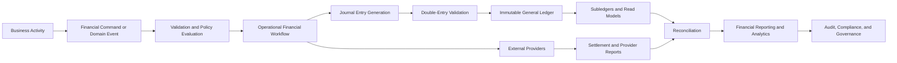
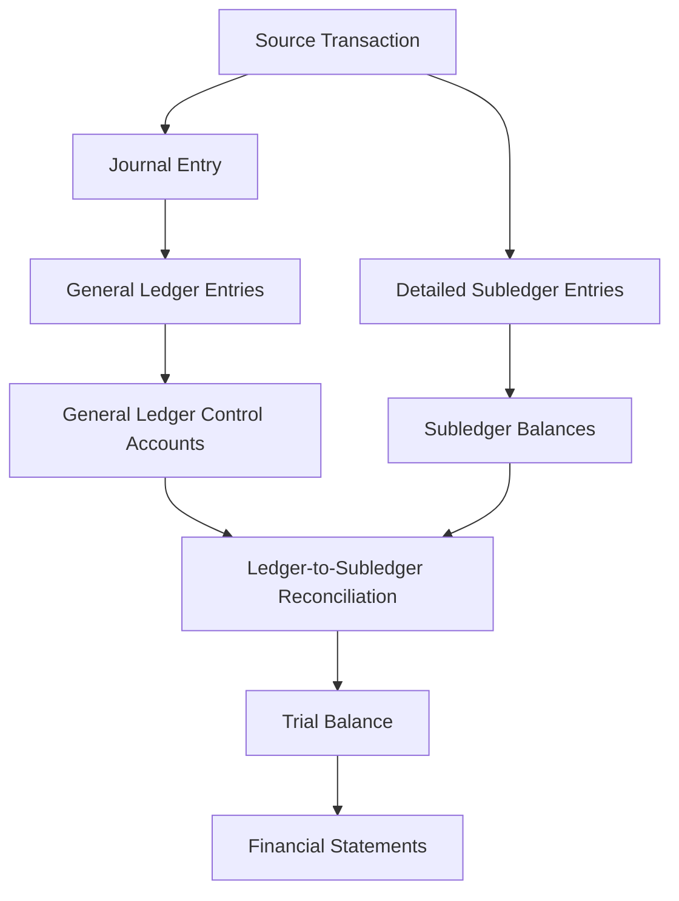

# AsBeez Financial System

> **Document:** `12-financial-system/000-index.md`  
> **Domain:** Financial Management, Accounting, Payments, Treasury, Risk, Compliance, and Reporting  
> **Status:** Canonical Architecture and Documentation Index  
> **Architecture Style:** Domain-Driven Design, CQRS, Event Sourcing, Double-Entry Accounting, Immutable Ledgers, Event-Driven Integration, and AI-Assisted Operations

---

## 1. Overview

The **AsBeez Financial System** is the authoritative financial backbone of the AsBeez ecosystem. It records, classifies, protects, reconciles, settles, analyzes, and reports every financially significant event generated by the platform.

The system supports the economic relationships among customers, members, vendors, partners, countries, payment providers, banks, tax authorities, reward programs, reserve funds, and the AsBeez company itself. It transforms operational activity into auditable financial records while preserving double-entry integrity, transaction traceability, country isolation, currency precision, regulatory accountability, and long-term scalability.

The Financial System is not merely a payment-processing module. It is a coordinated collection of bounded contexts responsible for:

- financial account management;
- general-ledger and subledger accounting;
- member wallets and stored-value balances;
- Reward Point, ABC, and AHC financial accounting;
- payment authorization, capture, settlement, and reconciliation;
- withdrawals, payouts, reserves, and holds;
- invoicing, revenue recognition, fees, commissions, and taxes;
- vendor and partner financial settlement;
- refunds, returns, cancellations, disputes, and chargebacks;
- multi-currency and foreign-exchange operations;
- treasury, liquidity, budgeting, forecasting, and period close;
- financial reporting, analytics, fraud controls, governance, audit, and security;
- APIs, events, integrations, observability, testing, administration, and AI assistance.

Every financial capability documented under this folder must preserve the principle that **business activity may be corrected, reversed, or compensated, but historical financial records must never be silently rewritten or destroyed**.

---

## 2. Purpose

The purpose of this documentation area is to define the complete business, domain, accounting, technical, operational, security, compliance, and strategic design of the AsBeez Financial System.

It provides a shared source of truth for:

- founders and executive leadership;
- finance and accounting teams;
- treasury and payment operations;
- product managers and business analysts;
- software architects and engineers;
- data, analytics, and AI teams;
- security, compliance, legal, and audit teams;
- country operators and regional administrators;
- vendors, partners, and approved integration providers;
- quality assurance, reliability, and support teams.

This documentation establishes how financial value enters, moves through, and exits the AsBeez ecosystem; how every movement is represented in the ledger; and how balances are validated against external and internal sources.

---

## 3. Financial System Vision

The AsBeez Financial System is designed to become a globally scalable, country-aware, multi-currency financial platform capable of supporting a broad marketplace and loyalty ecosystem without sacrificing accounting integrity or regulatory control.

The long-term vision is a financial platform that is:

1. **Ledger-first** — every financial consequence is represented through balanced, immutable accounting entries.
2. **Event-driven** — financial workflows respond to durable domain events and publish reliable financial outcomes.
3. **Country-aware** — taxation, currencies, payment methods, payout rules, compliance controls, reserves, and reporting can vary by jurisdiction.
4. **Multi-entity ready** — the platform can support multiple legal entities, operating companies, countries, business units, and settlement structures.
5. **Real-time where appropriate** — operational balances and risk indicators update quickly without compromising accounting control.
6. **Auditable by design** — every decision, posting, adjustment, approval, configuration change, and exception is traceable.
7. **Secure by default** — sensitive financial operations require strong authentication, authorization, encryption, separation of duties, and monitoring.
8. **AI-assisted, not AI-controlled** — artificial intelligence may classify, explain, forecast, detect anomalies, and recommend actions, but material financial decisions remain governed by deterministic rules and human approval.
9. **Reconciliation-centered** — no reported balance is considered trustworthy merely because it exists in a database; balances must be reconciled to their authoritative sources.
10. **Designed for longevity** — records, contracts, events, configurations, and policies are versioned so the system can explain historical outcomes years later.

---

## 4. Core Objectives

The Financial System must achieve the following objectives:

### 4.1 Accounting Integrity

- Enforce double-entry accounting for every posted financial transaction.
- Prevent unbalanced journal entries from being posted.
- Preserve immutable journal and ledger history.
- Support reversals and compensating entries instead of destructive edits.
- Maintain clear relationships between source transactions, journals, ledger entries, subledger entries, and reports.

### 4.2 Accurate Financial Position

- Maintain reliable balances for cash, receivables, liabilities, reserves, revenue, expenses, wallets, rewards, vendors, partners, taxes, and equity.
- Distinguish available, pending, held, reserved, settled, disputed, and restricted balances.
- Support near-real-time operational views and authoritative accounting-period views.

### 4.3 Global Commerce Support

- Support multiple currencies, countries, payment providers, payout methods, tax systems, and local financial rules.
- Isolate country-specific financial operations while enabling controlled consolidation.
- Maintain transaction, settlement, reporting, and base currencies independently.

### 4.4 Financial Control and Compliance

- Enforce approval thresholds, segregation of duties, transaction limits, KYC/AML controls, sanctions checks, and source-of-funds requirements.
- Provide complete audit trails and evidence for internal and external review.
- Preserve financial records according to legal, tax, accounting, privacy, and operational retention requirements.

### 4.5 Operational Resilience

- Ensure idempotent processing across commands, APIs, events, webhooks, and provider callbacks.
- Support retries, duplicate detection, failure recovery, reconciliation, replay, and disaster recovery.
- Prevent partial workflows from creating unexplained or orphaned balances.

### 4.6 Financial Intelligence

- Deliver reliable financial statements, management reports, operational dashboards, forecasts, and anomaly alerts.
- Enable governed AI assistance for transaction classification, reconciliation, fraud detection, forecasting, explanations, and financial close.

---

## 5. System Scope

### 5.1 In Scope

The Financial System owns or governs:

- chart of accounts and account governance;
- journal entries, ledger postings, accounting periods, and close;
- financial subledgers and balance projections;
- wallet financial balances, holds, reserves, statements, and transaction history;
- payment and payout financial workflows;
- invoice, refund, chargeback, fee, commission, tax, and settlement accounting;
- revenue recognition, deferred revenue, accrued revenue, and financial allocations;
- vendor and partner earnings, liabilities, reserves, statements, and payouts;
- Reward Point, ABC, AHC, compensation-fund, and charity-fund accounting;
- treasury, bank accounts, cash positioning, liquidity, and cash forecasting;
- multi-currency valuation and foreign-exchange accounting;
- budgeting, forecasting, reconciliation, reporting, analytics, and audit;
- financial risk, fraud, security, compliance, administration, and configuration;
- financial APIs, webhooks, events, read models, integrations, and observability.

### 5.2 Outside the Primary Scope

The following domains may generate financial consequences but remain primarily owned by other AsBeez systems:

- identity, authentication, and general user profile management;
- membership qualification and lifecycle management;
- product catalog and content management;
- shopping cart and nonfinancial order orchestration;
- vendor onboarding and storefront management;
- partner relationship and growth-program management;
- Beehive Matrix placement logic;
- notification delivery;
- document storage and general content management.

These external domains integrate with the Financial System through stable APIs, commands, events, policies, and shared identifiers. They must not directly mutate financial ledger records.

---

## 6. Foundational Design Principles

### 6.1 Double-Entry by Default

Every posted financial transaction must produce total debits equal to total credits within the applicable ledger, currency, legal entity, and accounting context.

### 6.2 Immutable Financial History

Posted journal entries and ledger entries are append-only. Errors are corrected through reversals, adjustments, or compensating entries with references to the original records.

### 6.3 Single Authoritative Source per Balance

Each balance must have a clearly defined system of record. Read models, dashboards, caches, and reports are projections and must be reproducible from authoritative records.

### 6.4 Money as a Value Object

Monetary amounts must always include currency and precision rules. Floating-point arithmetic must never be used for financial calculations.

### 6.5 Explicit Financial States

Transactions must use explicit, validated state machines. Pending, authorized, captured, settled, failed, reversed, refunded, disputed, held, and released states must never be inferred only from loosely related fields.

### 6.6 Idempotency Everywhere

Any operation capable of being retried must support deterministic duplicate prevention. Provider callbacks, event handlers, posting commands, transfer requests, and payout instructions require idempotency controls.

### 6.7 Separation of Operational and Accounting Concerns

Operational workflows may progress asynchronously, but accounting consequences must be explicit, balanced, traceable, and posted under defined accounting policies.

### 6.8 Reconciliation Is Mandatory

Internal balances must be reconciled against subledgers, banks, payment providers, payout providers, tax records, and settlement reports. Unreconciled differences must become managed exceptions.

### 6.9 Configuration Is Versioned

Fee rules, tax rates, account mappings, exchange-rate policies, limits, approval matrices, reserve percentages, and accounting policies must be effective-dated and historically reproducible.

### 6.10 Country and Legal-Entity Awareness

Every financially significant record must carry sufficient context to determine the responsible country, legal entity, currency, accounting policy, tax treatment, and reporting obligation.

### 6.11 Least Privilege and Separation of Duties

No individual or service should possess unnecessary authority over initiation, approval, posting, settlement, reconciliation, and reporting of the same material financial transaction.

### 6.12 AI Recommendations Require Governance

AI-generated classifications, forecasts, anomaly scores, explanations, and recommended actions must include provenance, confidence, model version, and approval requirements. AI must not directly create irreversible financial consequences without deterministic controls.

---

## 7. High-Level Financial Flow

A typical financial transaction begins with a validated business event, proceeds through an operational workflow, generates balanced accounting entries, updates authorized projections, and is subsequently reconciled against internal and external evidence.

---

## 8. Core Financial Invariants

The following invariants apply across the entire Financial System:

1. Total debits must equal total credits for every posted journal entry.
2. Posted financial records must not be deleted or overwritten.
3. A transaction must not be posted twice for the same idempotency scope.
4. Currency must be explicit on every monetary amount and ledger entry.
5. Amount precision must follow the applicable currency and accounting policy.
6. A financial state transition must be valid from the current state.
7. Available balances must not include pending, held, reserved, disputed, or restricted amounts unless explicitly allowed by policy.
8. A payout must not exceed the validated available balance after fees, taxes, reserves, holds, and limits.
9. A refund or reversal must reference the original economic transaction.
10. External settlements must be reconciled before being considered final for accounting and treasury purposes.
11. Closed accounting periods must reject unauthorized backdated postings.
12. Every manual adjustment must include reason, evidence, initiator, approver, and audit metadata.
13. Financial configuration must be effective-dated and versioned.
14. Cross-country and cross-entity entries must use approved intercompany, clearing, or settlement accounts.
15. Financial reports must be traceable to ledger and source records.
16. Sensitive financial data must be protected according to classification and jurisdiction.
17. AI output must never replace deterministic ledger validation.

---

## 9. Major Bounded Contexts

| Bounded Context | Primary Responsibility | Authoritative Records |
|---|---|---|
| Financial Accounts | Chart of accounts, account lifecycle, classifications, mappings | Financial accounts and account versions |
| General Ledger | Journals, ledger entries, periods, postings, reversals | Posted journals and ledger entries |
| Subledgers | Detailed balances by wallet, reward, vendor, partner, tax, and provider | Subledger entries and reconciled balances |
| Wallets | Member financial balances, holds, credits, debits, and statements | Wallet accounts and wallet transactions |
| Reward Finance | RP, ABC, AHC, reward liabilities, funds, and financial recognition | Reward financial entries and liabilities |
| Payments | Payment intents, authorization, capture, settlement, and failure recovery | Payment transactions and provider references |
| Payouts | Withdrawals, approvals, batches, provider processing, and settlement | Payout instructions and payout transactions |
| Invoicing | Invoice creation, taxation, credits, debits, delivery, and lifecycle | Invoices, notes, and line items |
| Revenue | Order economics, platform fees, revenue recognition, and settlement | Revenue schedules and recognition entries |
| Vendor Finance | Vendor earnings, fees, reserves, liabilities, statements, and payouts | Vendor financial accounts and settlements |
| Partner Finance | Partner commissions, bonuses, holds, statements, and payouts | Partner financial accounts and settlements |
| Refunds and Disputes | Refunds, returns, cancellations, chargebacks, and evidence | Refund and dispute cases |
| Tax | Jurisdiction, calculation, withholding, remittance, and reporting | Tax transactions and tax liabilities |
| Currency and FX | Rates, conversion, valuation, gains, losses, and exposure | Exchange-rate versions and FX entries |
| Reserves and Funds | Operating, refund, chargeback, reward, compensation, and charity funds | Reserve accounts and fund movements |
| Treasury | Bank accounts, cash position, liquidity, transfers, and cash forecasting | Treasury accounts and bank transactions |
| Reconciliation | Matching, exceptions, discrepancy resolution, and certification | Reconciliation runs, matches, and exceptions |
| Reporting and Analytics | Statements, management reports, KPIs, dashboards, and forecasts | Reproducible reporting projections |
| Risk and Compliance | Fraud controls, transaction monitoring, AML, approvals, and governance | Cases, risk decisions, and compliance evidence |

---

## 10. Relationship to Core AsBeez Economic Assets

### 10.1 Reward Points

Reward Points are noncash economic units governed by the Rewards Engine and financially represented through the Reward Finance subledger. The Financial System records their issuance, redemption, conversion, liability treatment, adjustment, forfeiture, and reconciliation according to approved accounting policy.

### 10.2 AsBeez Business Cells

An AsBeez Business Cell represents a qualified participation unit created when the applicable Reward Point threshold is met. The Financial System records the accounting consequences of ABC creation, including Reward Point consumption, AHC distribution obligations, reserve allocations, and any related financial liabilities.

### 10.3 AsBeez Hive Credits

AsBeez Hive Credits represent earned value distributed through the Beehive Matrix and other approved programs. The Financial System maintains the authoritative financial subledger for AHC, including pending, available, held, adjusted, withdrawn, and settled amounts.

### 10.4 Member Wallets

Member wallets provide the operational interface through which eligible balances are displayed and used. Wallet balances must be derived from immutable financial transactions and reconciled against the applicable subledgers and general-ledger control accounts.

### 10.5 Compensation and Charity Funds

The Compensation Fund and Charity Fund are separately governed pools with dedicated accounts, subledgers, allocation rules, approvals, reporting, and audit requirements. Their balances must never be commingled with unrestricted operating funds without approved accounting treatment.

---

## 11. Transaction Lifecycle

A generalized financial transaction follows these stages:

1. **Initiation** — a user, system, scheduled process, or external provider initiates a transaction.
2. **Authentication and authorization** — identity, permissions, transaction authority, and approval requirements are validated.
3. **Business validation** — limits, balances, status, country rules, currency rules, compliance requirements, and domain invariants are evaluated.
4. **Risk evaluation** — transaction risk, fraud signals, sanctions, velocity, account integrity, and policy exceptions are assessed.
5. **Reservation or hold** — funds or balances may be reserved to prevent conflicting use.
6. **External processing** — payment, banking, tax, FX, or payout providers may be invoked.
7. **Accounting determination** — the correct journal template, accounts, amounts, currency treatment, dimensions, and recognition timing are determined.
8. **Ledger posting** — balanced, immutable journal and ledger entries are posted.
9. **Projection update** — wallets, subledgers, statements, dashboards, and operational views are updated.
10. **Settlement** — external value transfer is confirmed.
11. **Reconciliation** — internal records are matched to provider, bank, settlement, or source-system records.
12. **Reporting and close** — activity is included in financial statements, management reports, tax reports, and period-close controls.
13. **Audit retention** — source records, approvals, events, evidence, and configurations are retained according to policy.

---

## 12. Accounting Model

The AsBeez Financial System uses a layered accounting model:

### 12.1 Source Transaction

The business or financial event that caused the economic change, such as an order, payment, refund, reward distribution, payout, fee, tax, or manual adjustment.

### 12.2 Journal Entry

The accounting representation of the source transaction. It contains one or more debit and credit lines and must be balanced before posting.

### 12.3 General Ledger

The authoritative summarized accounting record organized by financial account, entity, country, currency, period, and reporting dimension.

### 12.4 Subledger

The detailed supporting record for balances such as wallets, vendors, partners, rewards, taxes, providers, reserves, refunds, and commissions.

### 12.5 Reconciliation

The controlled process of confirming agreement between the general ledger, subledgers, source systems, providers, banks, and other authoritative evidence.

---

## 13. Data and Record Classification

Financial records must be classified and handled according to sensitivity:

| Classification | Examples | Minimum Protection |
|---|---|---|
| Public | Published fee schedules, supported currencies | Integrity controls |
| Internal | Account mappings, operational procedures, internal reports | Authenticated access |
| Confidential | Member balances, vendor earnings, forecasts, tax records | Encryption and role-based access |
| Restricted | Bank details, payout credentials, payment tokens, government identifiers | Strong encryption, masking, least privilege, detailed audit |
| Highly Restricted | Cryptographic secrets, signing keys, unmasked regulated payment data | Dedicated key management, strict isolation, monitored access |

Sensitive payment-card data should be minimized, tokenized, and delegated to compliant providers wherever possible.

---

## 14. Nonfunctional Requirements

### 14.1 Accuracy

Financial calculations must be deterministic, reproducible, precision-safe, and backed by automated validation.

### 14.2 Availability

Critical payment, wallet, payout, ledger, and reconciliation services must have defined availability targets, degraded-mode behavior, and recovery procedures.

### 14.3 Scalability

The system must support growth in transaction volume, countries, currencies, providers, members, vendors, partners, accounts, events, and reporting requirements through partitioning, asynchronous processing, and independently scalable read models.

### 14.4 Performance

Operational balance checks and transaction validation must meet defined latency objectives while preserving correctness. Reporting workloads must not compromise transaction processing.

### 14.5 Consistency

Strong consistency is required for critical balance mutations, ledger posting, idempotency, holds, releases, and state transitions. Eventual consistency may be used for projections and analytics where explicitly documented.

### 14.6 Recoverability

The system must support point-in-time recovery, event replay, provider callback replay, projection rebuild, reconciliation recovery, and tested disaster-recovery procedures.

### 14.7 Explainability

Every balance, posting, fee, tax, conversion, hold, payout, and adjustment must be explainable from source records, policies, configurations, and approvals.

---

## 15. Documentation Map

### 15.1 Foundation and Accounting Core

| Section | Description |
|---|---|
| [001-overview](001-overview/000-index.md) | Purpose, vision, objectives, scope, capabilities, stakeholders, constraints, dependencies, and roadmap. |
| [010-financial-domain-model](010-financial-domain-model/000-index.md) | Bounded contexts, aggregates, entities, value objects, services, policies, events, invariants, and ubiquitous language. |
| [020-chart-of-accounts](020-chart-of-accounts/000-index.md) | Account classifications, hierarchy, numbering, lifecycle, country and currency structures, and governance. |
| [030-general-ledger](030-general-ledger/000-index.md) | Double-entry accounting, journals, posting, periods, adjustments, reversals, reconciliation, auditability, and retention. |
| [040-subledgers](040-subledgers/000-index.md) | Detailed financial records for wallets, rewards, vendors, customers, partners, tax, providers, refunds, reserves, and funds. |

### 15.2 Wallets, Rewards, Payments, and Payouts

| Section | Description |
|---|---|
| [050-member-wallets](050-member-wallets/000-index.md) | Wallet types, creation, balances, credits, debits, transfers, holds, reserves, statements, limits, security, and compliance. |
| [060-reward-finance](060-reward-finance/000-index.md) | Financial treatment of Reward Points, ABCs, AHC, matrix distributions, reward liabilities, reserves, adjustments, and audits. |
| [070-payments](070-payments/000-index.md) | Payment intents, authorization, capture, settlement, routing, retries, provider integration, reconciliation, security, APIs, and events. |
| [080-payouts-and-withdrawals](080-payouts-and-withdrawals/000-index.md) | Withdrawal validation, approvals, payout batches, methods, limits, fees, holds, failures, reversals, compliance, and reconciliation. |

### 15.3 Commerce Finance

| Section | Description |
|---|---|
| [090-invoicing](090-invoicing/000-index.md) | Invoice types, numbering, generation, taxes, discounts, adjustments, credit and debit notes, delivery, localization, and compliance. |
| [100-orders-and-revenue](100-orders-and-revenue/000-index.md) | Order financial models, GMV, platform and participant revenue, revenue recognition, deferrals, accruals, settlement, and reporting. |
| [110-vendor-finance](110-vendor-finance/000-index.md) | Vendor earnings, commissions, fees, reserves, holds, settlement, payouts, refunds, chargebacks, tax withholding, and statements. |
| [120-partner-finance](120-partner-finance/000-index.md) | Partner earnings, commissions, bonuses, incentives, reserves, settlement, payouts, adjustments, reconciliation, and statements. |
| [130-refunds-returns-and-cancellations](130-refunds-returns-and-cancellations/000-index.md) | Refund eligibility, full and partial refunds, cancellations, return accounting, wallet refunds, reward reversals, and fraud controls. |
| [140-chargebacks-and-disputes](140-chargebacks-and-disputes/000-index.md) | Chargeback lifecycle, evidence, representment, arbitration, accounting, liability, reserves, fees, reporting, and reconciliation. |
| [150-fees-and-commissions](150-fees-and-commissions/000-index.md) | Platform, transaction, subscription, listing, service, processing, withdrawal, FX, vendor, partner, and referral fees and commissions. |

### 15.4 Tax, Currency, Reserves, and Treasury

| Section | Description |
|---|---|
| [160-taxes](160-taxes/000-index.md) | Tax jurisdictions, sales tax, VAT, GST, withholding, exemptions, calculation, invoices, remittance, reporting, and provider integration. |
| [170-multi-currency-and-fx](170-multi-currency-and-fx/000-index.md) | Supported currencies, exchange rates, rate locking, conversion, precision, FX gains and losses, cross-border settlement, and risk. |
| [180-reserves-and-funds](180-reserves-and-funds/000-index.md) | Operating, refund, chargeback, vendor, partner, reward, compensation, charity, promotional, country, and liquidity reserves. |
| [190-treasury-and-cash-management](190-treasury-and-cash-management/000-index.md) | Bank accounts, cash positioning, liquidity, forecasting, transfers, reconciliation, cash concentration, country treasury, and FX exposure. |

### 15.5 Planning, Close, Reconciliation, and Reporting

| Section | Description |
|---|---|
| [200-budgeting-and-forecasting](200-budgeting-and-forecasting/000-index.md) | Budget cycles, operating and capital budgets, country and department budgets, forecasts, scenarios, variances, approvals, and revisions. |
| [210-financial-periods-and-close](210-financial-periods-and-close/000-index.md) | Fiscal calendars, periods, opening, locking, month-end, quarter-end, year-end, accruals, deferrals, adjustments, and close controls. |
| [220-reconciliation](220-reconciliation/000-index.md) | Ledger, subledger, bank, provider, wallet, reward, vendor, partner, tax, reserve, and cross-country reconciliation. |
| [230-financial-reporting](230-financial-reporting/000-index.md) | Trial balance, financial statements, ledger reports, liability reports, settlement reports, tax, country, consolidated, management, and regulatory reporting. |
| [240-financial-analytics](240-financial-analytics/000-index.md) | KPIs, revenue, profitability, cash flow, wallets, rewards, vendors, partners, countries, payments, refunds, chargebacks, taxes, and forecasts. |

### 15.6 Risk, Governance, Audit, and Security

| Section | Description |
|---|---|
| [250-fraud-risk-and-controls](250-fraud-risk-and-controls/000-index.md) | Transaction risk, payment and wallet fraud, payout and refund fraud, chargeback abuse, reward abuse, account takeover, scoring, monitoring, and cases. |
| [260-compliance-and-governance](260-compliance-and-governance/000-index.md) | Financial governance, accounting policies, recognition policies, AML, KYC controls, sanctions, source of funds, approvals, retention, and country compliance. |
| [270-audit-and-internal-controls](270-audit-and-internal-controls/000-index.md) | Audit trails, control framework, preventive, detective, corrective, access, change, reconciliation, close, testing, evidence, exceptions, and remediation. |
| [280-security](280-security/000-index.md) | Authentication, authorization, RBAC, separation of duties, transaction authorization, encryption, tokenization, keys, secrets, PCI DSS, monitoring, and incidents. |

### 15.7 Technical Architecture and Platform Interfaces

| Section | Description |
|---|---|
| [290-architecture](290-architecture/000-index.md) | Service boundaries, CQRS, event sourcing, ledger architecture, orchestration, sagas, outbox, idempotency, concurrency, consistency, partitioning, and resilience. |
| [300-data-model](300-data-model/000-index.md) | Schemas for accounts, journals, ledgers, wallets, payments, payouts, invoices, refunds, disputes, tax, currencies, reserves, reconciliation, periods, reports, and events. |
| [310-api](310-api/000-index.md) | API standards, authentication, authorization, idempotency, filtering, errors, domain APIs, webhooks, rate limits, and versioning. |
| [320-events](320-events/000-index.md) | Event contracts, domain events, versioning, replay, dead-letter handling, and future event strategy. |
| [330-ai-capabilities](330-ai-capabilities/000-index.md) | Financial copilot, classification, account recommendation, reconciliation, anomaly and fraud detection, forecasting, close, audit, compliance, reporting, and governance. |
| [340-integrations](340-integrations/000-index.md) | Payment gateways, banks, payout providers, tax and FX providers, accounting platforms, ERP, BI, fraud, KYC/AML, notifications, warehouse, and webhooks. |
| [350-observability](350-observability/000-index.md) | Financial, business, and technical metrics, structured logs, traces, correlation IDs, monitoring, alerting, dashboards, objectives, and incidents. |
| [360-testing](360-testing/000-index.md) | Unit, domain, ledger, double-entry, integration, API, event, contract, reconciliation, close, concurrency, replay, load, security, compliance, and recovery testing. |

### 15.8 Operations, Administration, Configuration, and Strategy

| Section | Description |
|---|---|
| [370-operations](370-operations/000-index.md) | Daily financial operations, payment, payout, refund, dispute, reconciliation, close, treasury, tax, support, exceptions, incidents, continuity, recovery, and runbooks. |
| [380-administration](380-administration/000-index.md) | Financial administration dashboards and controlled management of accounts, journals, wallets, payments, payouts, invoices, refunds, disputes, tax, reserves, close, reports, and permissions. |
| [390-configuration](390-configuration/000-index.md) | Global and country settings for currencies, rounding, ledgers, wallets, payments, payouts, invoices, refunds, fees, taxes, reserves, close, risk, AI, and feature flags. |
| [400-strategy](400-strategy/000-index.md) | Financial operating model, global rollout, providers, banking, treasury, tax, compliance, risk, automation, AI, data, cost, scalability, and roadmap. |
| [999-reference](999-reference/000-index.md) | Glossaries, accounting terms, account and transaction catalogs, journal and ledger references, diagrams, schemas, APIs, events, configurations, scenarios, controls, and FAQs. |

---

## 16. Integration Boundaries

The Financial System integrates with other AsBeez domains through explicit contracts.

| External Domain | Financial Interaction |
|---|---|
| Identity Engine | Provides authenticated actors, roles, legal identity references, and access context. |
| Membership Engine | Provides customer/member status, country residency, qualification, and lifecycle events. |
| Commerce Engine | Provides orders, products, services, prices, discounts, cancellations, and fulfillment milestones. |
| Revenue Allocation Engine | Provides approved allocations among company revenue, compensation funds, reserves, and other destinations. |
| Rewards Engine | Provides RP, ABC, AHC, reward qualification, issuance, conversion, and distribution events. |
| Vendor Engine | Provides vendor identity, contracts, fee plans, settlement preferences, and compliance status. |
| Partner Engine | Provides partner relationships, programs, commission rules, incentives, and eligibility. |
| Beehive Matrix | Provides deterministic placement and reward-distribution results that require financial accounting. |
| Country Configuration | Provides jurisdiction, currency, taxation, compliance, threshold, and provider configuration. |
| Notification Services | Delivers invoices, statements, payout notices, alerts, exceptions, and approval requests. |
| Data Platform | Receives governed financial projections for analytics while respecting financial data controls. |

No external domain may bypass Financial System contracts to alter wallets, balances, journals, ledger entries, settlements, reserves, or reported financial values.

---

## 17. Financial Event Principles

Financial events must:

- use stable, versioned contracts;
- include a unique event identifier;
- include aggregate and correlation identifiers;
- include source-system and causation metadata;
- include country, entity, currency, and accounting context where applicable;
- be published through a transactional outbox or equivalent reliable mechanism;
- support idempotent consumption;
- avoid exposing restricted data unnecessarily;
- remain replayable within governed retention and compatibility limits;
- preserve the distinction between business events, operational financial events, and posted accounting events.

Examples include:

- `PaymentAuthorized`
- `PaymentCaptured`
- `PaymentSettled`
- `WalletCredited`
- `WalletHoldPlaced`
- `WithdrawalApproved`
- `PayoutSettled`
- `RewardLiabilityRecognized`
- `ABCCreated`
- `AHCDistributed`
- `RefundCompleted`
- `ChargebackOpened`
- `JournalEntryPosted`
- `LedgerPeriodClosed`
- `ReconciliationExceptionDetected`

The canonical event catalog is maintained under [320-events](320-events/000-index.md) and [999-reference/011-events-reference.md](999-reference/011-events-reference.md).

---

## 18. Security and Control Model

All material financial activity must be protected through layered controls:

1. authenticated actors and services;
2. least-privilege authorization;
3. role-based and attribute-based access controls where appropriate;
4. separation of initiation, approval, execution, reconciliation, and audit duties;
5. configurable approval thresholds;
6. strong customer and administrator authentication;
7. encryption in transit and at rest;
8. tokenization and data minimization;
9. tamper-evident audit trails;
10. transaction risk scoring and monitoring;
11. rate limits and velocity controls;
12. security alerts and incident response;
13. periodic access review and control testing;
14. secure configuration and secret management;
15. country-specific compliance enforcement.

Manual financial operations must receive stricter controls than ordinary business actions because they can directly alter liabilities, cash positions, revenue, expenses, reserves, or reported results.

---

## 19. AI Governance Principles

AI capabilities may assist finance users and systems by:

- suggesting account classifications;
- matching reconciliation records;
- detecting anomalies and fraud patterns;
- forecasting revenue, expenses, cash flow, and liquidity;
- explaining financial movements and variances;
- drafting reports and close summaries;
- prioritizing audit and compliance exceptions;
- answering governed natural-language questions over approved financial data.

AI must not:

- bypass double-entry validation;
- modify posted ledger history;
- approve its own material recommendation;
- autonomously release restricted funds without policy authorization;
- invent missing evidence or transactions;
- expose confidential or restricted data outside permitted contexts;
- make untraceable financial decisions.

Every production AI decision or recommendation affecting finance must be logged with model version, prompt or feature context, source data references, confidence, result, reviewer action, and final disposition where appropriate.

---

## 20. Implementation Priorities

A recommended implementation sequence is:

### Phase 1 — Financial Foundation

- financial domain model;
- money, currency, account, journal, and ledger value objects;
- chart of accounts;
- double-entry general ledger;
- immutable posting and reversal model;
- financial event contracts;
- audit trail and access controls.

### Phase 2 — Core Subledgers and Wallets

- wallet subledger;
- reward subledgers;
- vendor and partner subledgers;
- holds, reserves, and balance projections;
- ledger-to-subledger reconciliation.

### Phase 3 — Payments and Revenue

- payment intent, authorization, capture, settlement, and provider reconciliation;
- order accounting;
- fees and commissions;
- invoices, refunds, and revenue recognition;
- vendor and partner settlement.

### Phase 4 — Payouts, Tax, and Multi-Currency

- withdrawals and payouts;
- tax engine integration and tax accounting;
- currency conversion and FX accounting;
- country-specific configurations and settlement rules.

### Phase 5 — Treasury, Close, and Reporting

- bank accounts and cash management;
- reserves and funds;
- accounting periods and close;
- financial statements and management reporting;
- budgeting and forecasting.

### Phase 6 — Advanced Control and Intelligence

- enterprise reconciliation;
- fraud and risk controls;
- compliance automation;
- advanced analytics;
- governed AI capabilities;
- multi-region resilience and global consolidation.

Each implementation phase must include domain rules, APIs, events, data models, observability, security, testing, operational runbooks, migration plans, and reconciliation controls before production release.

---

## 21. Definition of Done

A Financial System capability is not complete until:

- business rules and invariants are documented;
- domain ownership and boundaries are explicit;
- financial-accounting consequences are defined;
- journal templates and account mappings are approved;
- APIs and events are versioned and documented;
- idempotency and concurrency behaviors are tested;
- security and approval controls are implemented;
- audit evidence is retained;
- reconciliation sources and procedures are defined;
- failure, retry, reversal, and recovery paths are tested;
- operational dashboards, alerts, and runbooks exist;
- country and currency rules are validated;
- data retention and privacy obligations are addressed;
- financial reports reconcile to authoritative records;
- stakeholders have approved the capability for production use.

---

## 22. Documentation Standards

Every document under `12-financial-system` should, where applicable, include:

- purpose and scope;
- business context;
- terminology;
- actors and stakeholders;
- domain model;
- aggregates, entities, and value objects;
- business rules and invariants;
- transaction or state lifecycle;
- accounting treatment and journal examples;
- APIs, commands, queries, and events;
- data model and retention;
- security, privacy, compliance, and audit controls;
- reconciliation requirements;
- failure and exception handling;
- observability and operational metrics;
- testing strategy;
- scalability and resilience considerations;
- AI opportunities and governance;
- examples, diagrams, and related documents;
- future roadmap.

Documentation must distinguish current approved behavior from proposed future behavior. Assumptions and unresolved decisions must be labeled clearly.

---

## 23. Related AsBeez Documentation

The Financial System should be read together with:

- `00-the-asbeez-principles/`
- `01-founder-vision/`
- `02-business-blueprint/`
- `03-platform-strategy/`
- `04-core-engines/`
- `09-vendor-engine/`
- `10-rewards-loyalty/`
- `11-beehive-matrix/`
- `13-platform-services/`
- `14-legal-compliance/`
- `16-system-architecture/`
- `17-database/`
- `18-api/`
- `20-operations/`
- `23-architecture-decisions/`
- `24-business-rules/`
- `25-standards/`

When documents conflict, the most recently approved policy, architecture decision record, business rule, or governing legal requirement takes precedence. Conflicts must be documented and resolved rather than silently interpreted.

---

## 24. Summary

The AsBeez Financial System provides the trusted accounting and financial-control foundation required to operate a global marketplace, loyalty ecosystem, vendor network, partner platform, and reward economy.

Its defining characteristics are:

- immutable and balanced financial records;
- clear domain ownership and transaction states;
- authoritative subledgers and reconciled control accounts;
- country-aware, multi-currency operations;
- secure and compliant movement of value;
- transparent vendor, partner, member, reward, and fund accounting;
- reliable payment, payout, refund, dispute, tax, and treasury workflows;
- reproducible reporting and analytics;
- resilient event-driven architecture;
- governed automation and AI assistance;
- complete traceability from business event to financial statement.

This index is the primary navigation and governance entry point for all documentation under `12-financial-system`.
