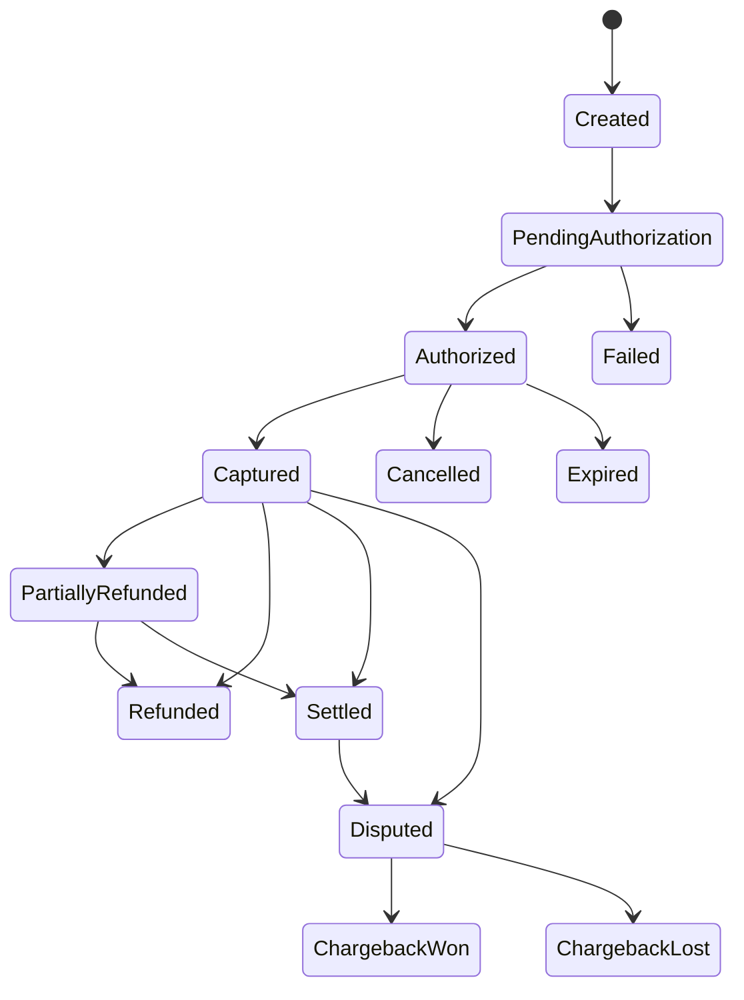
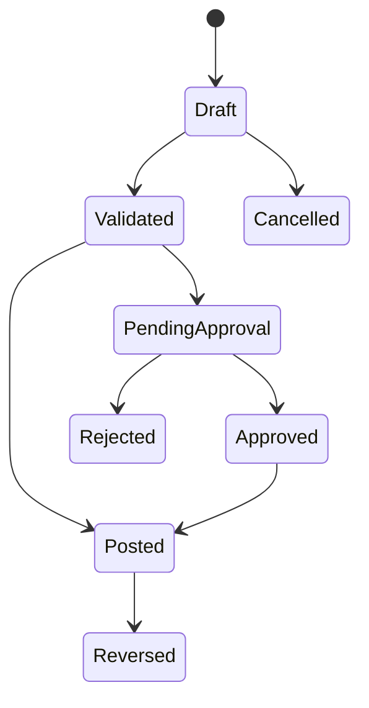
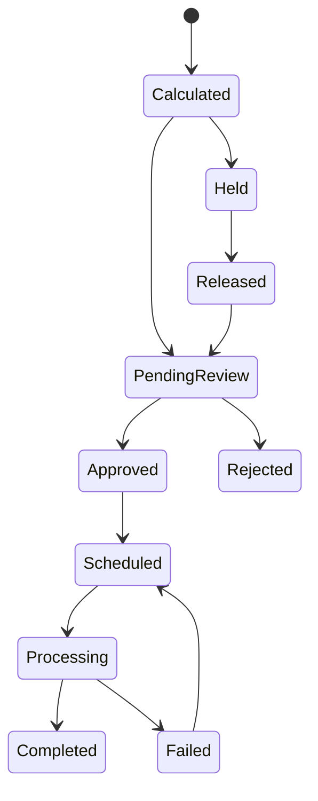
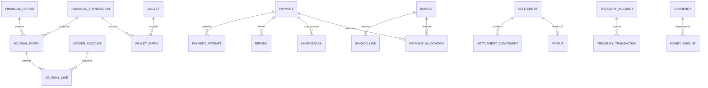
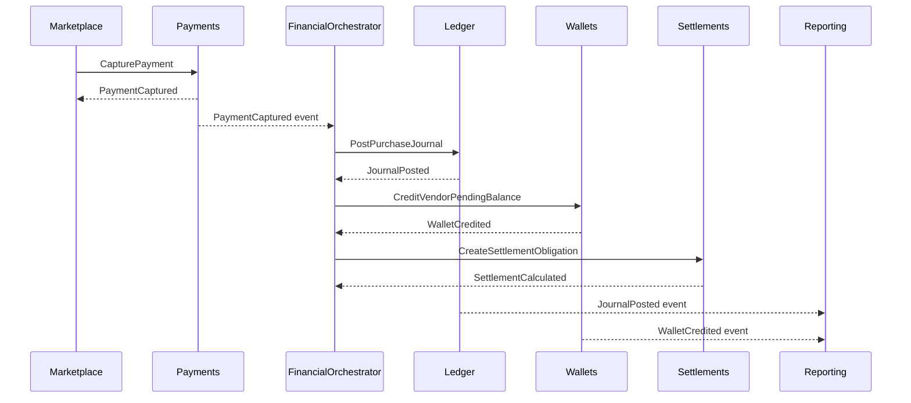

# 000-index.md

# Financial Domain Model

**Module:** Financial System
**Parent Module:** `12-financial-system`
**Folder:** `010-financial-domain-model`
**Document:** `000-index.md`
**Version:** 1.0
**Status:** Architecture Foundation
**Classification:** Internal Enterprise Architecture
**Primary Audience:** Software Architects, Finance Engineers, Backend Developers, Domain Experts, Product Managers, Auditors, Security Engineers, AI Engineers, and Technical Leadership

---

# Table of Contents

1. [Executive Summary](#executive-summary)
2. [Purpose of This Folder](#purpose-of-this-folder)
3. [Domain Model Vision](#domain-model-vision)
4. [Why the Financial Domain Model Matters](#why-the-financial-domain-model-matters)
5. [Domain-Driven Design Approach](#domain-driven-design-approach)
6. [Financial Domain Context](#financial-domain-context)
7. [Core Modeling Principles](#core-modeling-principles)
8. [Financial Domain Capability Map](#financial-domain-capability-map)
9. [Bounded Context Overview](#bounded-context-overview)
10. [Core Domain Concepts](#core-domain-concepts)
11. [Entity Overview](#entity-overview)
12. [Aggregate Overview](#aggregate-overview)
13. [Value Object Overview](#value-object-overview)
14. [Domain Service Overview](#domain-service-overview)
15. [Domain Event Overview](#domain-event-overview)
16. [State Machine Overview](#state-machine-overview)
17. [Business Rules and Invariants](#business-rules-and-invariants)
18. [Ubiquitous Language](#ubiquitous-language)
19. [Domain Relationships](#domain-relationships)
20. [Domain Ownership and Boundaries](#domain-ownership-and-boundaries)
21. [Command and Event Flow](#command-and-event-flow)
22. [Financial Transaction Lifecycle](#financial-transaction-lifecycle)
23. [Ledger Integration](#ledger-integration)
24. [Wallet Integration](#wallet-integration)
25. [Rewards Integration](#rewards-integration)
26. [Marketplace Integration](#marketplace-integration)
27. [Vendor and Partner Integration](#vendor-and-partner-integration)
28. [Treasury Integration](#treasury-integration)
29. [Tax and Compliance Integration](#tax-and-compliance-integration)
30. [Multi-Currency Considerations](#multi-currency-considerations)
31. [Auditability and Traceability](#auditability-and-traceability)
32. [Security Considerations](#security-considerations)
33. [AI and Financial Intelligence](#ai-and-financial-intelligence)
34. [Persistence Strategy](#persistence-strategy)
35. [API and Integration Implications](#api-and-integration-implications)
36. [Laravel Implementation Guidance](#laravel-implementation-guidance)
37. [Testing Strategy](#testing-strategy)
38. [Operational Considerations](#operational-considerations)
39. [Governance](#governance)
40. [Folder Documentation Map](#folder-documentation-map)
41. [Recommended Implementation Sequence](#recommended-implementation-sequence)
42. [Success Criteria](#success-criteria)
43. [Future Evolution](#future-evolution)
44. [Summary](#summary)

---

# Executive Summary

The Financial Domain Model defines the conceptual, behavioral, and structural foundation of the entire AsBeez Financial System.

It establishes how financial concepts are represented in software, how financial objects relate to one another, how financial state changes, which rules must always remain true, and how financial responsibilities are divided across bounded contexts.

The domain model is not merely a database schema.

It is not a list of Laravel models.

It is not a collection of accounting tables.

It is the formal representation of the financial business itself.

The Financial Domain Model translates real-world financial concepts into software constructs such as:

* Bounded contexts
* Entities
* Aggregates
* Aggregate roots
* Value objects
* Domain services
* Domain events
* Commands
* Policies
* Specifications
* State machines
* Business rules
* Invariants
* Repositories
* Factories

These constructs form the common language shared by:

* Finance teams
* Accountants
* Product managers
* Developers
* Architects
* Compliance officers
* Auditors
* AI systems
* Operational teams

A well-designed domain model ensures that the software behaves according to financial reality rather than merely reflecting technical convenience.

Within AsBeez, the Financial Domain Model must support a complex ecosystem that includes:

* Customers
* Members
* Vendors
* Partners
* Marketplaces
* Orders
* Payments
* Refunds
* Chargebacks
* Wallets
* Reward Points
* AsBeez Business Cells
* AsBeez Hive Credits
* Vendor earnings
* Partner commissions
* Treasury accounts
* Taxes
* Fees
* Reserves
* Settlements
* Reconciliation
* Financial statements

Every movement of value must be represented consistently, accurately, and transparently.

The model must ensure that:

* Money is never represented using floating-point arithmetic.
* Posted accounting entries are immutable.
* Every financial movement is traceable to its source.
* Every journal entry remains balanced.
* Wallet balances correspond to ledger-backed activity.
* Duplicate requests do not create duplicate financial effects.
* Financial corrections occur through compensating transactions.
* Currency rules are explicitly enforced.
* Financial state transitions are valid and controlled.
* Cross-domain integrations do not bypass financial controls.

This folder documents the complete Financial Domain Model and serves as the architectural foundation for all downstream financial modules.

---

# Purpose of This Folder

The purpose of the `010-financial-domain-model` folder is to define the official domain model used throughout the AsBeez Financial System.

It answers the following questions:

* What are the primary financial concepts?
* Which concepts are entities?
* Which concepts are value objects?
* Which entities belong together inside aggregates?
* Which aggregate roots control state changes?
* What business rules apply?
* What invariants must always remain true?
* What events occur when financial state changes?
* Which services coordinate complex financial operations?
* How do financial objects transition between states?
* What terminology should every team use?
* Which domain owns each piece of financial behavior?
* How should these concepts map into application code?

This folder is intended to prevent inconsistent implementations across different teams and modules.

Without a centralized domain model, developers may create conflicting interpretations of concepts such as:

* Balance
* Available Balance
* Ledger Balance
* Settlement
* Payout
* Payment
* Earnings
* Revenue
* Reward
* Liability
* Hold
* Reserve
* Refund
* Reversal
* Adjustment

This documentation establishes one canonical interpretation for each concept.

---

# Domain Model Vision

The Financial Domain Model is designed to become the stable conceptual foundation of an evolving global financial platform.

Its vision is to create a model that is:

* Financially correct
* Explicit
* Modular
* Auditable
* Extensible
* Global
* Multi-currency
* Event-driven
* AI-readable
* Implementation-independent
* Suitable for long-term enterprise growth

The model should remain valid even if the underlying technology changes.

For example, AsBeez may begin with:

* Laravel
* MySQL or PostgreSQL
* Redis
* Queues
* Modular monolith architecture

The platform may later evolve toward:

* Independently deployed services
* Event streaming
* Distributed databases
* Regional financial services
* Data warehouses
* AI agents
* Dedicated ledger infrastructure

The domain model should remain conceptually stable throughout this evolution.

---

# Why the Financial Domain Model Matters

Financial software is inherently more sensitive than ordinary business software.

A content management error may cause an incorrect page to appear.

A financial modeling error may cause:

* Incorrect customer balances
* Duplicate charges
* Overpaid vendors
* Underpaid partners
* Misstated revenue
* Unbalanced ledgers
* Regulatory violations
* Audit failures
* Tax errors
* Loss of customer trust
* Direct financial loss

The domain model serves as the first line of defense against these failures.

It establishes explicit rules before implementation begins.

## Benefits of a Strong Financial Domain Model

A strong model provides:

* Shared understanding
* Consistent terminology
* Clear ownership
* Reduced duplication
* Safer financial operations
* Better auditability
* Easier testing
* More predictable integrations
* Lower technical debt
* Faster onboarding
* Better AI interpretation
* Easier future service extraction

## Risks of a Weak Domain Model

A weak or inconsistent model leads to:

* Conflicting definitions
* Incorrect database relationships
* Business logic scattered across controllers
* Duplicate financial calculations
* Direct balance manipulation
* Untraceable adjustments
* Impossible reconciliation
* Fragile integrations
* Unclear responsibility
* Difficult auditing

For this reason, the Financial Domain Model must be treated as an architectural control, not merely documentation.

---

# Domain-Driven Design Approach

The AsBeez Financial System follows Domain-Driven Design principles.

Domain-Driven Design begins with the business domain rather than the database or framework.

The design process starts by understanding:

* Financial activities
* Business policies
* Accounting obligations
* Regulatory requirements
* Operational workflows
* Stakeholder responsibilities
* Financial risks

These concepts are then modeled using software constructs that preserve their meaning.

## Core DDD Building Blocks

The Financial Domain Model uses the following building blocks.

### Bounded Context

A clearly defined domain boundary within which terminology and rules have a consistent meaning.

Examples:

* General Ledger
* Payments
* Wallets
* Treasury
* Settlements
* Tax
* Revenue Recognition

### Entity

An object with a unique identity that persists through time.

Examples:

* Financial Transaction
* Journal Entry
* Wallet
* Invoice
* Payment
* Settlement

### Aggregate

A consistency boundary containing related entities and value objects.

All changes within an aggregate are controlled by an aggregate root.

### Aggregate Root

The only entry point through which external code may modify an aggregate.

Examples:

* Wallet
* Payment
* Journal Entry
* Settlement Batch

### Value Object

An immutable object defined by its attributes rather than identity.

Examples:

* Money
* Currency
* Exchange Rate
* Accounting Period
* Percentage
* Tax Amount

### Domain Service

A stateless service that performs domain logic that does not naturally belong to one entity.

Examples:

* Currency Conversion Service
* Settlement Calculation Service
* Revenue Allocation Service
* Posting Rule Resolver

### Domain Event

A record of something meaningful that happened within the domain.

Examples:

* PaymentCaptured
* WalletCredited
* JournalPosted
* SettlementApproved
* RefundCompleted

### Invariant

A rule that must remain true before and after every valid state transition.

Examples:

* Journal entries must balance.
* Wallet available balance cannot exceed ledger balance.
* A completed payment cannot be captured again.
* A posted journal cannot be edited.

---

# Financial Domain Context

The Financial Domain Model represents the official financial meaning of operational activity across AsBeez.

Operational modules may determine what happened from a business perspective.

The Financial System determines what that activity means financially.

For example:

| Operational Event           | Financial Interpretation                                                    |
| --------------------------- | --------------------------------------------------------------------------- |
| Customer completes purchase | Cash received, revenue or deferred revenue recorded, vendor payable created |
| Vendor earns sale proceeds  | Vendor liability increases                                                  |
| Member receives an approved AHC financial benefit | Reward liability, expense, redemption, or no monetary effect according to jurisdictional policy |
| Refund is approved          | Revenue and payment effects are reversed or adjusted                        |
| Chargeback is received      | Payment dispute and financial loss exposure are recorded                    |
| Vendor payout is completed  | Vendor liability decreases and cash decreases                               |
| Tax is collected            | Tax payable liability increases                                             |
| Subscription begins         | Deferred revenue may be created                                             |
| Service is completed        | Revenue may be recognized                                                   |

This separation ensures that operational modules do not become unofficial accounting systems.

---

# Core Modeling Principles

The Financial Domain Model follows the principles below.

## 1. Financial Value Is Explicit

Money, currencies, rates, balances, taxes, and fees must be represented explicitly.

Financial values must not be passed as ambiguous primitive numbers.

Preferred:

```php
$amount = Money::ofMinor(419500, Currency::USD);
```

Avoid:

```php
$amount = 4195.00;
```

## 2. Identity Is Stable

Entities use durable identifiers that remain stable across:

* Database migrations
* Event publishing
* Service integrations
* Data exports
* Regional deployments

## 3. State Changes Are Controlled

Entities may not transition arbitrarily between states.

For example, a payment may move through:

```text
Created
→ Authorized
→ Captured
→ Settled
```

It may not move directly from `Created` to `Settled` unless a specific supported payment flow permits it.

## 4. Posted Financial Records Are Immutable

Once a financial record becomes official, it may not be edited.

Corrections use:

* Reversals
* Compensating entries
* Adjustment entries
* Supplemental entries

## 5. Aggregates Protect Invariants

State changes occur only through aggregate behavior.

External code must never manipulate internal aggregate members directly.

## 6. Financial Effects Are Idempotent

The same external request or event must not produce duplicate financial outcomes.

## 7. Currency Is Never Implied

Every monetary amount must include an explicit currency.

## 8. Time Is Financially Significant

The model distinguishes:

* Event time
* Posting time
* Effective date
* Settlement date
* Recognition date
* Period date
* Created timestamp

## 9. Audit Context Is Required

Every material financial action records:

* Actor
* Source
* Reason
* Correlation ID
* Timestamp
* Approval context
* Originating event

## 10. External Systems Cannot Bypass Domain Rules

Payment gateways, marketplaces, administrators, and AI services interact through approved commands and APIs.

They may not directly manipulate financial records.

---

# Financial Domain Capability Map

```mermaid
flowchart TB
    FS[Financial Domain]

    FS --> GL[General Ledger]
    FS --> COA[Chart of Accounts]
    FS --> PAY[Payments]
    FS --> WAL[Wallets]
    FS --> BILL[Billing and Invoicing]
    FS --> REV[Revenue Recognition]
    FS --> SET[Settlements]
    FS --> TRE[Treasury]
    FS --> TAX[Tax]
    FS --> REC[Reconciliation]
    FS --> REP[Financial Reporting]
    FS --> AUD[Audit and Compliance]
    FS --> FX[Multi-Currency]
    FS --> RWD[Reward Accounting]
    FS --> COM[Commission Accounting]
    FS --> FEE[Fee Management]
```



Each capability may eventually become an independently deployable service, but the initial architecture may implement them as modules inside a modular monolith.

---

# Bounded Context Overview

The Financial Domain is divided into bounded contexts to prevent conceptual and technical overlap.

## Primary Bounded Contexts

| Bounded Context       | Primary Responsibility                          |
| --------------------- | ----------------------------------------------- |
| General Ledger        | Official double-entry accounting record         |
| Chart of Accounts     | Account classification and structure            |
| Payments              | Incoming payment lifecycle                      |
| Wallets               | Participant balance management                  |
| Billing               | Invoice and receivable obligations              |
| Revenue Recognition   | Determination of earned revenue                 |
| Settlements           | Amounts owed to external participants           |
| Treasury              | Organizational cash and liquidity               |
| Tax                   | Tax calculation, recording, and liability       |
| Reconciliation        | Comparison of internal and external records     |
| Reward Accounting     | Financial treatment of RP, ABC, and AHC         |
| Commission Accounting | Partner and referral compensation               |
| Financial Reporting   | Official financial statements and analytics     |
| Audit and Compliance  | Traceability, controls, and regulatory evidence |
| Foreign Exchange      | Currency conversion and revaluation             |

## Supporting Bounded Contexts

Supporting contexts may include:

* Financial Configuration
* Approval Management
* Financial Document Management
* Financial Period Management
* Risk and Fraud Monitoring
* Financial AI Services
* Data Export and Regulatory Filing

A detailed description of each bounded context is provided in `001-bounded-contexts.md`.

---

# Core Domain Concepts

The following concepts form the center of the Financial Domain Model.

## Financial Transaction

A financial transaction represents a complete business-level movement or transformation of financial value.

Examples:

* Customer payment
* Wallet transfer
* Refund
* Vendor settlement
* Commission payout
* Treasury transfer
* Reward conversion
* Fee deduction

A financial transaction may produce one or more journal entries.

## Journal Entry

A journal entry is the official accounting representation of a financial event.

It contains balanced debit and credit lines.

## Journal Line

A journal line records an amount posted to one ledger account.

## Ledger Account

A ledger account classifies financial value according to the Chart of Accounts.

## Wallet

A wallet represents a controlled balance associated with a participant, fund, or internal financial purpose.

## Balance

A balance is a calculated financial position derived from ledger-backed entries.

A balance must not be treated as an arbitrary editable number.

## Payment

A payment represents the lifecycle of funds received or attempted from a payer through a payment method or provider.

## Refund

A refund represents the return of previously collected funds.

## Chargeback

A chargeback represents a payment reversal initiated through a payment network or financial institution.

## Invoice

An invoice represents a formal amount owed by a customer or organization.

## Settlement

A settlement represents an amount payable to a vendor, partner, member, or other external participant after applying fees, holds, taxes, adjustments, and reserves.

## Payout

A payout is the execution of a transfer from AsBeez-controlled funds to an external recipient.

## Treasury Account

A treasury account represents an internal bank, reserve, cash, or liquidity account controlled by AsBeez.

## Financial Obligation

A financial obligation represents an amount owed by one party to another.

## Reward Liability

A reward liability represents the financial obligation associated with earned but not yet redeemed or settled rewards.

## Commission

A commission represents compensation earned according to an approved partner, referral, or growth program.

## Fee

A fee represents an amount charged for a defined service, transaction, platform function, or marketplace activity.

## Tax Liability

A tax liability represents tax collected or accrued but not yet remitted to the appropriate authority.

---

# Entity Overview

Entities are domain objects defined by identity and lifecycle.

Major entities include:

| Entity                | Identity            | Primary Responsibility                 |
| --------------------- | ------------------- | -------------------------------------- |
| Financial Transaction | Transaction ID      | Groups a complete financial operation  |
| Journal Entry         | Journal Entry ID    | Controls accounting posting            |
| Journal Line          | Journal Line ID     | Records debit or credit classification |
| Ledger Account        | Account ID          | Represents Chart of Accounts account   |
| Wallet                | Wallet ID           | Controls balance and wallet activity   |
| Wallet Entry          | Wallet Entry ID     | Records wallet movement                |
| Payment               | Payment ID          | Controls payment lifecycle             |
| Payment Attempt       | Attempt ID          | Records individual gateway attempt     |
| Refund                | Refund ID           | Controls refund lifecycle              |
| Chargeback            | Chargeback ID       | Controls dispute lifecycle             |
| Invoice               | Invoice ID          | Controls billing obligation            |
| Invoice Line          | Invoice Line ID     | Defines billed item                    |
| Settlement            | Settlement ID       | Represents payable settlement          |
| Settlement Batch      | Batch ID            | Groups settlement processing           |
| Payout                | Payout ID           | Controls outbound payment              |
| Treasury Account      | Treasury Account ID | Represents cash or reserve account     |
| Exchange Rate Record  | Rate Record ID      | Stores rate provenance                 |
| Tax Record            | Tax Record ID       | Records assessed tax                   |
| Reconciliation Case   | Case ID             | Tracks discrepancy resolution          |
| Financial Period      | Period ID           | Controls accounting periods            |
| Approval Request      | Approval ID         | Controls authorization workflow        |

Detailed entity definitions are provided in `002-core-entities.md`.

---

# Aggregate Overview

Aggregates define transactional consistency boundaries.

A financial aggregate should remain small enough to support performance while large enough to protect critical invariants.

## Candidate Aggregate Roots

### Journal Entry Aggregate

Contains:

* Journal Entry
* Journal Lines
* Posting Metadata
* Reversal References

Protects:

* Balanced debit and credit totals
* Currency consistency
* Posting immutability
* Valid account usage

### Wallet Aggregate

Contains:

* Wallet
* Balance Summary
* Holds
* Wallet Policy References

Protects:

* Valid wallet status
* Sufficient available balance
* Valid credit and debit operations
* Hold and release rules

Historical wallet entries may be stored outside the aggregate and referenced through ledger-backed queries to avoid unbounded aggregate growth.

### Payment Aggregate

Contains:

* Payment
* Payment Attempts
* Authorization References
* Capture References
* Refund Summary
* Provider Metadata

Protects:

* Payment state transitions
* Maximum capturable amount
* Maximum refundable amount
* Idempotency
* Provider consistency

### Invoice Aggregate

Contains:

* Invoice
* Invoice Lines
* Tax Summary
* Payment Allocation Summary

Protects:

* Invoice total calculation
* Currency consistency
* Status transitions
* Amount due

### Settlement Aggregate

Contains:

* Settlement
* Settlement Components
* Fees
* Taxes
* Holds
* Adjustments

Protects:

* Net settlement calculation
* Approval status
* Recipient ownership
* Currency consistency

### Payout Aggregate

Contains:

* Payout
* Destination
* Execution Attempts
* Failure Reasons

Protects:

* Authorized payout amount
* Recipient verification
* Execution state
* Retry safety

### Reconciliation Case Aggregate

Contains:

* Reconciliation Case
* Matching Candidates
* Exceptions
* Resolution
* Evidence

Protects:

* Resolution workflow
* Evidence retention
* Approval requirements

Detailed aggregate definitions are provided in `003-aggregates.md`.

---

# Value Object Overview

Value objects express financial meaning while preventing primitive-value ambiguity.

## Core Financial Value Objects

| Value Object           | Purpose                                       |
| ---------------------- | --------------------------------------------- |
| Money                  | Amount plus currency                          |
| Currency               | ISO currency identity and precision           |
| Exchange Rate          | Conversion rate between currencies            |
| Account Code           | Valid Chart of Accounts code                  |
| Journal Reference      | External or internal posting reference        |
| Transaction Reference  | Unique financial operation reference          |
| Percentage             | Valid bounded percentage                      |
| Tax Rate               | Tax-specific percentage and jurisdiction      |
| Fee Amount             | Structured fee representation                 |
| Date Range             | Inclusive or exclusive financial time range   |
| Accounting Period      | Financial posting period                      |
| Effective Date         | Date on which financial effect applies        |
| Settlement Window      | Rules determining settlement timing           |
| Bank Account Reference | Tokenized destination reference               |
| Wallet Owner           | Owner type and owner identifier               |
| Idempotency Key        | Unique operation deduplication key            |
| Correlation ID         | Cross-system trace identifier                 |
| Approval Threshold     | Amount requiring specific authority           |
| Financial Reason       | Standardized adjustment or transaction reason |
| Country Code           | Jurisdiction identifier                       |

Detailed value objects are documented in `004-value-objects.md`.

---

# Domain Service Overview

Some financial operations involve multiple aggregates or require domain knowledge that does not belong to one entity.

These operations are implemented through domain services.

## Candidate Domain Services

### Posting Service

Transforms approved financial activity into balanced journal entries.

### Settlement Calculation Service

Calculates:

* Gross earnings
* Platform fees
* Taxes
* Adjustments
* Holds
* Reserves
* Net payable amount

### Currency Conversion Service

Converts monetary values using approved exchange rates and rounding policies.

### Revenue Allocation Service

Allocates transaction value among:

* Platform revenue
* Vendor payable
* Tax liability
* Reward liability
* Partner commission
* Processing expense

### Refund Allocation Service

Determines the financial reversal effects of a refund.

### Commission Calculation Service

Determines commission amounts based on approved program rules.

### Reward Liability Service

Determines the financial liability created or released by reward activity.

### Reconciliation Matching Service

Matches internal records with provider, bank, or external settlement records.

### Financial Period Service

Determines whether a transaction may be posted into a given financial period.

### Approval Policy Service

Determines the approvals required for a financial action.

Detailed domain services are documented in `005-domain-services.md`.

---

# Domain Event Overview

Domain events communicate meaningful financial changes.

Events are stated in the past tense because they describe facts that have already occurred.

## Core Financial Domain Events

### Payment Events

* PaymentCreated
* PaymentAuthorized
* PaymentAuthorizationFailed
* PaymentCaptured
* PaymentCaptureFailed
* PaymentSettled
* PaymentCancelled
* PaymentExpired

### Refund Events

* RefundRequested
* RefundApproved
* RefundRejected
* RefundSubmitted
* RefundCompleted
* RefundFailed

### Wallet Events

* WalletCreated
* WalletActivated
* WalletCredited
* WalletDebited
* WalletFundsHeld
* WalletHoldReleased
* WalletFrozen
* WalletClosed

### Journal Events

* JournalDrafted
* JournalValidated
* JournalApproved
* JournalPosted
* JournalReversed

### Settlement Events

* SettlementCalculated
* SettlementReviewed
* SettlementApproved
* SettlementHeld
* SettlementReleased
* SettlementCompleted

### Payout Events

* PayoutRequested
* PayoutApproved
* PayoutSubmitted
* PayoutCompleted
* PayoutFailed
* PayoutCancelled

### Revenue Events

* RevenueDeferred
* RevenueRecognized
* RevenueAdjusted
* RevenueReversed

### Reward Events

* RewardLiabilityCreated
* RewardLiabilityReleased
* RewardRedeemed
* RewardExpired

### Reconciliation Events

* ReconciliationStarted
* TransactionMatched
* ReconciliationExceptionDetected
* ReconciliationCaseResolved
* ReconciliationCompleted

Detailed domain events are documented in `006-domain-events.md`.

---

# State Machine Overview

Financial entities often have controlled lifecycles.

State machines make valid and invalid transitions explicit.

## Payment State Machine



## Journal State Machine



## Settlement State Machine



Detailed state machines are documented in `007-state-machines.md`.

---

# Business Rules and Invariants

Business rules define expected financial behavior.

Invariants define conditions that must always remain true.

## Core Invariants

### Journal Balance Invariant

For every journal entry:

```text
Total Debits = Total Credits
```

### Currency Invariant

All journal lines within a single-currency journal must use the same currency unless the journal explicitly supports a multi-currency structure with base-currency equivalents.

### Wallet Integrity Invariant

A wallet balance may change only through approved wallet operations backed by financial entries.

### Refund Limit Invariant

The total completed refund amount may not exceed the refundable amount of the original payment.

### Capture Limit Invariant

The total captured amount may not exceed the authorized amount unless the provider and payment flow explicitly support incremental authorization.

### Settlement Invariant

```text
Gross Earnings
- Platform Fees
- Processing Fees
- Taxes
- Holds
- Reserves
+ Approved Adjustments
= Net Settlement
```

### Immutability Invariant

A posted journal entry may never be edited or deleted.

### Idempotency Invariant

The same idempotency key within the same operation scope may produce no more than one financial effect.

### Closed Period Invariant

Transactions may not be posted into a closed accounting period unless an authorized reopening or prior-period adjustment workflow is used.

### Ownership Invariant

A participant may access only financial records authorized for their identity, role, organization, and jurisdiction.

Detailed rules and invariants are documented in:

* `008-business-rules.md`
* `009-invariants.md`

---

# Ubiquitous Language

The Financial System uses a controlled vocabulary.

Terms must retain consistent meanings across:

* Documentation
* Code
* APIs
* Database schemas
* Events
* User interfaces
* Reports
* AI prompts
* Operational procedures

Examples:

| Term              | Meaning                                                               |
| ----------------- | --------------------------------------------------------------------- |
| Payment           | Incoming or attempted transfer of funds from a payer                  |
| Payout            | Outbound transfer of funds to a recipient                             |
| Settlement        | Calculation and obligation representing funds owed                    |
| Wallet            | Financial subledger representing controlled participant or fund value |
| Hold              | Temporary restriction preventing funds from being used                |
| Reserve           | Amount retained to protect against future obligations or risk         |
| Journal           | Balanced accounting record                                            |
| Posting           | Action that makes a journal official                                  |
| Reversal          | New entry that offsets a previous entry                               |
| Adjustment        | Authorized financial correction or modification through a new record  |
| Available Balance | Amount available for permitted use                                    |
| Ledger Balance    | Total recorded balance before certain restrictions                    |
| Deferred Revenue  | Payment received before revenue is earned                             |
| Payable           | Amount owed to another party                                          |
| Receivable        | Amount owed to AsBeez                                                 |
| Clearing Account  | Temporary account used during multi-step settlement                   |
| Suspense Account  | Temporary account used when classification is unresolved              |

The complete glossary is documented in `010-ubiquitous-language.md`.

---

# Domain Relationships

The following diagram shows major domain relationships.



This diagram is conceptual and does not dictate exact physical database design.

---

# Domain Ownership and Boundaries

Each bounded context owns its own domain behavior and data.

## Ownership Rules

* The Payments context owns payment lifecycle.
* The General Ledger owns official journal postings.
* The Wallet context owns wallet rules and wallet state.
* The Settlement context owns calculation of external obligations.
* The Treasury context owns organizational cash accounts.
* The Revenue Recognition context owns earned and deferred revenue decisions.
* The Reward Accounting context owns financial liability treatment of rewards.
* The Tax context owns tax financial obligations.
* The Reconciliation context owns matching and discrepancy resolution.

No bounded context may directly modify another context's internal persistence.

Interaction occurs through:

* Commands
* APIs
* Domain events
* Integration events
* Published read models

---

# Command and Event Flow

Commands request action.

Events communicate facts.

## Example Purchase Flow



The orchestrator may be implemented as:

* Application service
* Saga
* Process manager
* Workflow engine

The exact mechanism may evolve, but the domain responsibilities must remain separated.

---

# Financial Transaction Lifecycle

A financial transaction may pass through the following conceptual lifecycle.


## Lifecycle Stages

### 1. Business Event

A business activity occurs.

Examples:

* Order completed
* Membership fee paid
* Reward earned
* Vendor payout requested

### 2. Financial Command

The Financial System receives an explicit request to create the financial effect.

### 3. Validation

The system validates:

* Required data
* Currency
* amount precision
* Account configuration
* Actor permissions
* Idempotency
* Business rules

### 4. Authorization

Required approval rules are evaluated.

### 5. Financial Calculation

The system calculates:

* Gross amount
* Fees
* Taxes
* commissions
* Rewards
* Net amount
* Allocations

### 6. Journal Construction

Balanced journal entries are created.

### 7. Posting

The journal becomes official and immutable.

### 8. Subledger Update

Relevant subledgers and projections are updated.

### 9. Event Publication

Domain and integration events are emitted.

### 10. Reconciliation

Internal records are matched with external sources.

### 11. Reporting

Financial reports and dashboards are updated.

### 12. Audit and Analytics

The complete history becomes available for audit and intelligence.

---

# Ledger Integration

The General Ledger is the authoritative accounting destination for financial activity.

Every material financial event should produce ledger impact.

However, not every operational event requires its own journal.

For example:

* A payment authorization may not create a journal if no value has moved.
* A payment capture normally creates a journal.
* A wallet hold may affect available balance without immediately changing ownership.
* A completed settlement payout creates cash and liability effects.

## Example Purchase Journal

Assume:

* Customer payment: `$100.00`
* Vendor earning: `$80.00`
* Platform revenue: `$15.00`
* Tax payable: `$5.00`

Possible journal:

| Account          |   Debit | Credit |
| ---------------- | ------: | -----: |
| Cash Clearing    | $100.00 |        |
| Vendor Payable   |         | $80.00 |
| Platform Revenue |         | $15.00 |
| Tax Payable      |         |  $5.00 |

The exact account design is governed by the Chart of Accounts documentation.

---

# Wallet Integration

Wallets represent participant or internal financial balances.

A wallet is not a replacement for the General Ledger.

Wallets function as operational subledgers.

## Wallet Types

Potential wallet types include:

* Customer Wallet
* Member Wallet
* Vendor Wallet
* Partner Wallet
* Reward Wallet
* Treasury Wallet
* Reserve Wallet
* Charity Wallet
* Promotional Wallet
* Compensation Fund Wallet
* Company Holding Wallet

## Balance Types

A wallet may expose:

* Ledger Balance
* Available Balance
* Pending Balance
* Held Balance
* Reserved Balance
* Withdrawable Balance

These balances must be calculated according to defined wallet policies.

## Wallet-Ledger Consistency

Wallet movement should remain reconcilable with ledger activity.

A wallet credit or debit must reference:

* Financial transaction
* Journal entry
* Source event
* Reason
* Currency
* Timestamp

---

# Rewards Integration

AsBeez includes a unique reward ecosystem involving:

* Reward Points
* AsBeez Business Cells
* AsBeez Hive Credits
* Referral rewards
* Compensation funds
* Charity funds
* Promotional incentives

The Financial Domain Model must distinguish between:

* Non-monetary qualification units
* Promotional values
* Redeemable financial credits
* Accounting liabilities
* Earned obligations
* Pending rewards
* Released rewards
* Expired or forfeited rewards

## Reward Modeling Principle

Not every reward unit automatically represents cash.

The financial treatment depends on:

* Redemption rights
* Transferability
* Expiration
* Withdrawal rights
* Legal classification
* Country policy
* Accounting policy

The Reward Engine determines eligibility and distribution rules.

The Financial System determines the official financial accounting treatment.

---

# Marketplace Integration

The Marketplace owns:

* Products
* Offers
* Carts
* Orders
* Fulfillment status
* Customer purchase experience

The Financial System owns:

* Payments
* Receivables
* Revenue
* Vendor liabilities
* Fees
* Taxes
* Refund accounting
* Settlement obligations

## Integration Principle

Marketplace prices and order totals are commercial inputs.

They are not official financial records until accepted and processed by the Financial System.

---

# Vendor and Partner Integration

## Vendor Financial Relationship

The Vendor Engine owns vendor identity, status, and storefront data.

The Financial System owns:

* Vendor earnings
* Vendor payable balances
* Settlement calculations
* Payouts
* Financial statements
* Tax withholding
* Reserve holds
* Adjustments

## Partner Financial Relationship

The Partner Engine owns:

* Partner type
* Program participation
* Referral relationships
* Growth activities
* Qualification

The Financial System owns:

* Commission obligations
* Bonus liabilities
* Settlement
* Payout
* Tax reporting
* Financial history

---

# Treasury Integration

Treasury manages the organization's actual cash and liquidity.

Treasury-related domain concepts include:

* Bank account
* Cash account
* Reserve account
* Clearing account
* Payment processor balance
* Restricted funds
* Operational cash
* Settlement funding
* Transfer instruction
* Cash position
* Liquidity threshold

Treasury activity must remain linked to official ledger activity.

---

# Tax and Compliance Integration

The domain model must support jurisdiction-aware financial behavior.

Tax concepts may include:

* Tax jurisdiction
* Tax category
* Tax rate
* Tax exemption
* Tax nexus
* Tax registration
* Tax assessment
* Tax collection
* Tax payable
* Tax remittance
* Withholding tax

Compliance concepts may include:

* KYC status
* AML risk status
* Transaction monitoring result
* Sanctions screening result
* Approval requirement
* Reporting obligation
* Data retention policy

Financial operations may be blocked or held when compliance conditions are not satisfied.

---

# Multi-Currency Considerations

Multi-currency behavior must be explicit.

The model should distinguish:

* Transaction Currency
* Settlement Currency
* Wallet Currency
* Account Currency
* Functional Currency
* Reporting Currency
* Base Currency

## Exchange Rate Requirements

Every conversion must record:

* Source currency
* Target currency
* Rate
* Rate source
* Rate timestamp
* Rate type
* Rounding policy
* Converted amount
* Original amount

Historical conversions must remain reproducible.

The system must not recalculate old transactions using current rates.

---

# Auditability and Traceability

Every financial object should support end-to-end traceability.

A financial investigator should be able to move from:

```text
Financial Statement
→ Ledger Account
→ Journal Entry
→ Journal Line
→ Financial Transaction
→ Payment or Settlement
→ Order or Business Event
→ Initiating User or System
```

## Required Traceability Fields

Where applicable, financial records should include:

* Unique identifier
* Correlation ID
* Causation ID
* Idempotency key
* Source system
* Source record ID
* Initiating actor
* Approving actor
* Business reason
* Created timestamp
* Effective date
* Posting date
* Country
* Currency
* Version
* Digital signature or integrity hash

---

# Security Considerations

The Financial Domain Model must enforce security at the domain level, not only at the interface level.

## Domain Security Controls

* Ownership validation
* Role-based authorization
* Approval thresholds
* Separation of duties
* Dual approval
* Transaction limits
* Country restrictions
* Wallet freeze
* Payout holds
* Fraud review
* Compliance verification

## Sensitive Domain Data

Sensitive fields may include:

* Bank account tokens
* Payout destination details
* Tax identifiers
* Payment provider references
* Financial balances
* Approval evidence
* Risk scores

Sensitive information should be:

* Encrypted
* Tokenized
* Masked
* Access-controlled
* Audited

---

# AI and Financial Intelligence

The domain model should be understandable to AI systems while preserving strict control over financial execution.

## AI Use Cases

AI may assist with:

* Transaction classification
* Account recommendation
* Reconciliation matching
* Fraud detection
* Cash forecasting
* Revenue forecasting
* Settlement anomaly detection
* Financial narrative generation
* Audit investigation
* Policy explanation

## AI Restrictions

AI must not:

* Directly modify posted journals
* Bypass aggregate rules
* Approve high-risk actions without policy
* Invent financial facts
* Alter historical records
* Execute unrestricted treasury transfers

## AI-Readable Domain Design

To support AI safely, domain records should include:

* Clear semantic labels
* Structured reason codes
* Explicit state
* Provenance
* Relationships
* Confidence metadata
* Policy references
* Explainable decision context

---

# Persistence Strategy

The domain model should remain conceptually independent from persistence.

However, persistence must support financial guarantees.

## Relational Persistence

A relational database is preferred for core transactional financial data because it supports:

* ACID transactions
* Constraints
* Referential integrity
* Strong consistency
* Indexing
* Mature backup and recovery

## Event Store

Selective event storage may support replay and audit, but the general ledger remains the authoritative accounting record. Event storage must not become an alternative balance calculation unless the reconciliation contract is explicit.

## Folder Documentation Map

| Document | Responsibility |
| --- | --- |
| [002-bounded-contexts.md](002-bounded-contexts.md) | Context ownership and integration rules |
| [003-aggregates.md](003-aggregates.md) | Consistency boundaries and aggregate roots |
| [004-entities.md](004-entities.md) | Identified financial objects and lifecycle concerns |
| [005-value-objects.md](005-value-objects.md) | Immutable monetary and reference values |
| [006-domain-services.md](006-domain-services.md) | Cross-aggregate financial operations |
| [007-repositories.md](007-repositories.md) | Persistence contracts and concurrency |
| [008-policies.md](008-policies.md) | Versioned, effective-dated business decisions |
| [009-specifications.md](009-specifications.md) | Composable validation predicates |
| [010-domain-events.md](010-domain-events.md) | Immutable facts and delivery contracts |
| [011-invariants.md](011-invariants.md) | Conditions that must always remain true |
| [012-state-machines.md](012-state-machines.md) | Permitted financial lifecycle transitions |
| [013-ubiquitous-language.md](013-ubiquitous-language.md) | Canonical financial vocabulary |
| [014-asbeez-financial-mapping.md](014-asbeez-financial-mapping.md) | AsBeez marketplace, reward, settlement, and ledger boundaries |

## Recommended Implementation Sequence

1. Approve the ubiquitous language and bounded-context ownership.
2. Encode value objects and invariants as domain-level validation.
3. Implement aggregate roots and state transitions with versioning.
4. Implement repositories with idempotency and durable outbox publication.
5. Implement domain services, policies, and specifications.
6. Publish versioned events and build projections for reporting and reconciliation.
7. Derive database tables, APIs, workflows, and tests from these contracts.

## Success Criteria

The model is ready for implementation when every financial operation has an owning context, aggregate boundary, command, policy, invariant, state transition, event, audit trail, and failure path. It must also be possible to explain a wallet balance and a financial statement back to immutable source facts.

## Future Evolution

The model may later support regional ledgers, additional payment providers, new reward programs, dedicated treasury services, or independently deployed bounded contexts. Those changes must preserve the language, invariants, auditability, and correction rules defined here.

# Summary

The Financial Domain Model is the contract between AsBeez business intent and implementation. It protects financial correctness by assigning ownership, making state explicit, preserving immutable facts, and requiring every derived balance or obligation to remain traceable to its source.
