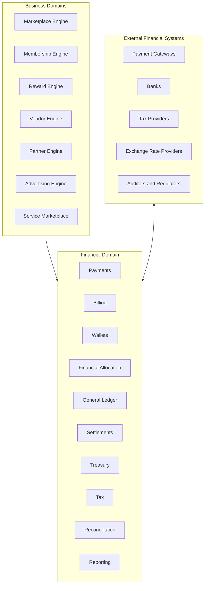
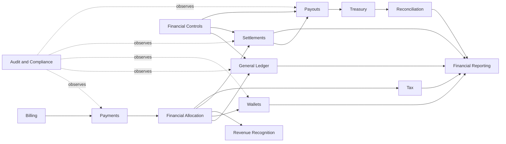
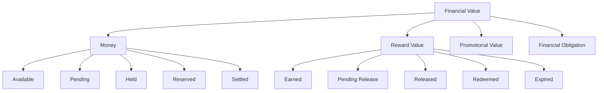
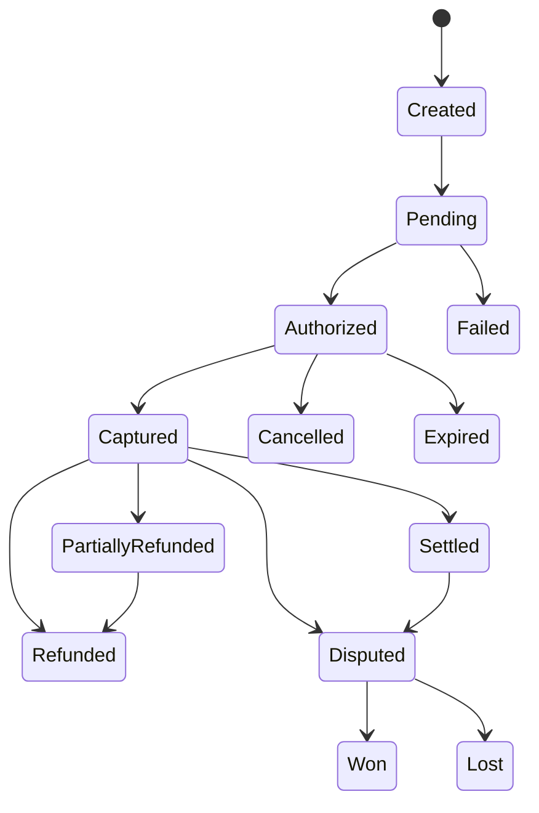
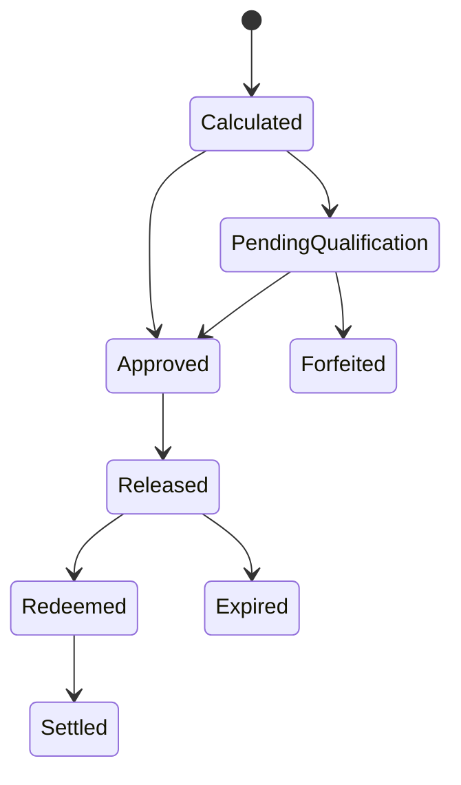

# 001-domain-overview.md

# Financial Domain Overview

**Module:** Financial System
**Parent Module:** `12-financial-system`
**Folder:** `010-financial-domain-model`
**Document:** `001-domain-overview.md`
**Version:** 1.0
**Status:** Architecture Foundation
**Classification:** Internal Enterprise Architecture
**Primary Audience:** Enterprise Architects, Finance Leaders, Accountants, Product Managers, Backend Developers, Security Engineers, Auditors, Data Engineers, AI Engineers, and Technical Leadership

---

# Table of Contents

1. [Executive Summary](#executive-summary)
2. [Purpose](#purpose)
3. [Scope](#scope)
4. [Financial Domain Vision](#financial-domain-vision)
5. [Domain Mission](#domain-mission)
6. [Business Context](#business-context)
7. [Why the Financial Domain Is a Core Domain](#why-the-financial-domain-is-a-core-domain)
8. [Domain Responsibilities](#domain-responsibilities)
9. [Domain Exclusions](#domain-exclusions)
10. [Financial Domain Landscape](#financial-domain-landscape)
11. [Domain-Driven Design Strategy](#domain-driven-design-strategy)
12. [Core, Supporting, and Generic Subdomains](#core-supporting-and-generic-subdomains)
13. [Financial Bounded Contexts](#financial-bounded-contexts)
14. [Context Relationships](#context-relationships)
15. [Core Financial Concepts](#core-financial-concepts)
16. [Financial Value Model](#financial-value-model)
17. [Financial Participant Model](#financial-participant-model)
18. [Financial Transaction Model](#financial-transaction-model)
19. [Accounting Model](#accounting-model)
20. [Subledger Model](#subledger-model)
21. [Wallet Model](#wallet-model)
22. [Payment Model](#payment-model)
23. [Billing and Invoice Model](#billing-and-invoice-model)
24. [Revenue Model](#revenue-model)
25. [Settlement and Payout Model](#settlement-and-payout-model)
26. [Treasury Model](#treasury-model)
27. [Reward Accounting Model](#reward-accounting-model)
28. [Commission Accounting Model](#commission-accounting-model)
29. [Tax Model](#tax-model)
30. [Foreign Exchange Model](#foreign-exchange-model)
31. [Reconciliation Model](#reconciliation-model)
32. [Financial Period Model](#financial-period-model)
33. [Approval and Control Model](#approval-and-control-model)
34. [Audit and Evidence Model](#audit-and-evidence-model)
35. [Financial Reporting Model](#financial-reporting-model)
36. [Domain Entities](#domain-entities)
37. [Aggregates and Consistency Boundaries](#aggregates-and-consistency-boundaries)
38. [Value Objects](#value-objects)
39. [Domain Services](#domain-services)
40. [Domain Policies](#domain-policies)
41. [Domain Events](#domain-events)
42. [Commands](#commands)
43. [State Machines](#state-machines)
44. [Business Rules and Invariants](#business-rules-and-invariants)
45. [Domain Lifecycle](#domain-lifecycle)
46. [Domain Integration Model](#domain-integration-model)
47. [Relationship with the Marketplace](#relationship-with-the-marketplace)
48. [Relationship with the Membership Engine](#relationship-with-the-membership-engine)
49. [Relationship with the Reward Engine](#relationship-with-the-reward-engine)
50. [Relationship with the Vendor Engine](#relationship-with-the-vendor-engine)
51. [Relationship with the Partner Engine](#relationship-with-the-partner-engine)
52. [Relationship with the Identity Engine](#relationship-with-the-identity-engine)
53. [Relationship with the AI Engine](#relationship-with-the-ai-engine)
54. [Data Ownership](#data-ownership)
55. [Consistency Strategy](#consistency-strategy)
56. [Idempotency](#idempotency)
57. [Immutability](#immutability)
58. [Temporal Modeling](#temporal-modeling)
59. [Multi-Country and Multi-Currency Design](#multi-country-and-multi-currency-design)
60. [Security and Privacy](#security-and-privacy)
61. [Compliance and Regulatory Readiness](#compliance-and-regulatory-readiness)
62. [Observability and Operational Intelligence](#observability-and-operational-intelligence)
63. [AI-Native Financial Domain](#ai-native-financial-domain)
64. [Implementation Architecture](#implementation-architecture)
65. [Laravel Implementation Direction](#laravel-implementation-direction)
66. [Database Modeling Direction](#database-modeling-direction)
67. [API and Event Design Direction](#api-and-event-design-direction)
68. [Testing Direction](#testing-direction)
69. [Governance](#governance)
70. [Risks and Anti-Patterns](#risks-and-anti-patterns)
71. [Success Criteria](#success-criteria)
72. [Future Evolution](#future-evolution)
73. [Related Documentation](#related-documentation)
74. [Summary](#summary)

---

# Executive Summary

The AsBeez Financial Domain represents the complete business model for recording, controlling, settling, reporting, and analyzing financial value throughout the AsBeez ecosystem.

It defines how financial obligations arise, how money enters and leaves the platform, how balances are maintained, how value is allocated among participants, how financial activity is recorded in the General Ledger, and how the organization proves the correctness of every financial result.

The Financial Domain is not limited to bookkeeping.

It governs the financial meaning of activity originating from:

* Marketplace transactions
* Customer purchases
* Membership payments
* Vendor sales
* Partner commissions
* Referral incentives
* Reward Point activity
* AsBeez Business Cell creation
* AsBeez Hive Credit distribution
* Subscription billing
* Advertiser spending
* Platform fees
* Taxes
* Refunds
* Chargebacks
* Settlement obligations
* Payouts
* Treasury transfers
* Promotional programs
* Compensation funds
* Charity allocations
* Future financial products

Operational modules describe what occurred in their respective business areas.

The Financial Domain determines what those activities mean financially.

For example, the Marketplace may determine that an order was completed. The Financial Domain determines:

* Whether revenue has been earned
* Whether cash has been received
* Whether tax is payable
* Whether a vendor liability exists
* Whether platform fees should be recognized
* Whether rewards create a financial liability
* Whether a partner commission is due
* Whether funds should remain pending
* Whether reserves or holds should apply
* Which ledger accounts must be debited and credited
* Which accounting period receives the transaction
* Which financial reports are affected

This domain therefore serves as the financial control plane of AsBeez.

It is responsible for maintaining the platform’s authoritative financial records and ensuring that all financial behavior remains:

* Accurate
* Balanced
* Traceable
* Authorized
* Auditable
* Idempotent
* Secure
* Reconciled
* Jurisdiction-aware
* Scalable
* Explainable

The domain is designed using Domain-Driven Design principles. It is divided into bounded contexts with explicit ownership, controlled interfaces, and consistent terminology.

Major bounded contexts include:

* General Ledger
* Chart of Accounts
* Payments
* Billing
* Wallets
* Revenue Recognition
* Vendor Settlements
* Partner Compensation
* Reward Accounting
* Treasury
* Tax
* Foreign Exchange
* Reconciliation
* Financial Reporting
* Financial Controls
* Audit and Compliance

The initial implementation may operate as a modular monolith using Laravel, a relational database, queues, and event-driven internal communication. The model is nevertheless designed so major bounded contexts can later be extracted into independently deployable services without redefining the underlying business language.

The Financial Domain Model must remain stable even as technologies, payment providers, currencies, jurisdictions, and business models change.

---

# Purpose

This document provides a comprehensive overview of the AsBeez Financial Domain.

Its purpose is to establish a shared understanding of:

* The purpose of the Financial Domain
* Its place within the broader AsBeez platform
* Its major responsibilities
* Its internal subdomains
* Its bounded contexts
* Its foundational financial concepts
* Its primary entities and aggregates
* Its business rules
* Its integration relationships
* Its architectural direction
* Its future evolution

This document acts as the entry point for detailed domain documentation within the `010-financial-domain-model` folder.

It should be read before documents covering:

* Bounded contexts
* Entities
* Aggregates
* Value objects
* Domain services
* Events
* State machines
* Business rules
* Invariants
* Ubiquitous language

---

# Scope

The Financial Domain includes the business concepts and behaviors necessary to manage the financial consequences of AsBeez platform activity.

## In Scope

The domain includes:

* Financial transactions
* Double-entry accounting
* Chart of Accounts
* Journal entries
* Journal lines
* Financial periods
* Wallets
* Balance management
* Holds
* Reserves
* Payment processing
* Payment attempts
* Refunds
* Chargebacks
* Billing
* Invoices
* Receivables
* Vendor earnings
* Vendor payables
* Partner commissions
* Member financial rewards
* Settlement calculation
* Payout processing
* Treasury
* Bank accounts
* Cash management
* Revenue recognition
* Deferred revenue
* Platform fees
* Tax liabilities
* Foreign exchange
* Revaluation
* Reconciliation
* Financial approvals
* Financial controls
* Audit evidence
* Financial reporting
* Financial forecasting data
* Financial anomaly signals
* Financial configuration

## Out of Scope

The Financial Domain does not own:

* Product catalogs
* Storefront presentation
* Shopping cart behavior
* Order fulfillment
* Member profile management
* Vendor onboarding workflow
* Partner relationship structure
* Reward qualification logic
* Marketing campaign execution
* CRM lead management
* Authentication implementation
* General notification delivery
* AI model hosting
* Content management
* Logistics operations

These areas may produce information or events consumed by the Financial Domain, but their core business behavior belongs to other modules.

---

# Financial Domain Vision

The vision of the Financial Domain is:

> To provide a globally scalable, highly controlled, AI-ready financial operating foundation that accurately represents every movement, obligation, allocation, and transformation of value across the AsBeez ecosystem.

The domain should enable AsBeez to answer, at any time:

* How much money does the organization control?
* Where is that money located?
* Who owns or is entitled to each amount?
* Which amounts are available, pending, held, reserved, or restricted?
* How much does AsBeez owe vendors?
* How much does AsBeez owe partners?
* How much reward liability exists?
* How much revenue has been earned?
* How much revenue remains deferred?
* How much tax has been collected?
* How much tax must be remitted?
* Which transactions remain unreconciled?
* Which payments failed or were disputed?
* Which payouts are scheduled?
* Which accounts contain unusual activity?
* Which financial records support each reported balance?
* Which actor approved each significant financial action?

The Financial Domain must produce these answers from authoritative, traceable records rather than estimates assembled from unrelated operational tables.

---

# Domain Mission

The mission of the Financial Domain is to:

1. Record all material financial activity accurately.
2. Preserve a permanent and auditable financial history.
3. Protect the financial interests of customers, members, vendors, partners, and AsBeez.
4. Enforce financial policies and approval controls.
5. Provide timely and accurate balances.
6. Support operational financial workflows.
7. Produce reliable accounting and management reports.
8. Enable reconciliation with banks, gateways, and external providers.
9. Support global currency and jurisdiction requirements.
10. Provide structured financial data for forecasting and AI analysis.
11. Prevent duplicate, unauthorized, or invalid financial effects.
12. Enable long-term expansion without compromising financial integrity.

---

# Business Context

AsBeez is intended to evolve into a multi-marketplace commerce and rewards ecosystem.

The platform may support:

* Digital products
* Professional services
* Physical products
* Real estate listings
* Motor vehicle listings
* Food ordering
* Insurance referrals
* Advertiser programs
* Subscription products
* Membership programs
* AI-powered business services
* Future embedded financial products

Each business area may introduce different financial patterns.

Examples include:

| Business Area        | Financial Pattern                                                      |
| -------------------- | ---------------------------------------------------------------------- |
| Digital Products     | Immediate payment and vendor earnings                                  |
| Physical Products    | Payment capture, fulfillment dependency, refunds, shipping allocations |
| Services             | Deposits, milestones, escrow-like holds, completion-based release      |
| Subscriptions        | Recurring billing and deferred revenue                                 |
| Advertising          | Prepaid budget, usage-based deduction, campaign balances               |
| Insurance Referrals  | Referral commission after qualification                                |
| Reward Programs      | Earned credits, liabilities, redemption, expiration                    |
| Vendor Subscriptions | Recurring invoices and platform revenue                                |
| Partner Programs     | Tiered commissions, bonuses, and settlement rules                      |
| Real Estate          | Listing fees, referral fees, service fees                              |
| Motors               | Listing subscriptions, lead fees, promotional packages                 |

The Financial Domain must support these patterns without embedding marketplace-specific logic into the General Ledger or payment infrastructure.

This requires a composable model in which operational activity is translated into configurable financial effects.

---

# Why the Financial Domain Is a Core Domain

In Domain-Driven Design, a core domain provides strategic differentiation and is central to the business model.

The AsBeez Financial Domain qualifies as a core domain because the platform’s value proposition depends heavily on its ability to:

* Allocate revenue accurately
* Manage complex reward obligations
* Calculate vendor and partner earnings
* Support the ABC and AHC compensation model
* Maintain trusted wallet balances
* Operate across countries
* Coordinate multiple marketplace models
* Reconcile high transaction volumes
* Provide transparent financial history
* Automate financial operations
* Apply AI safely to financial intelligence

The AsBeez reward and compensation architecture is not a generic accounting requirement.

It includes unique concepts such as:

* Reward Points
* AsBeez Business Cells
* AsBeez Hive Credits
* Country-specific ABC thresholds
* Referral-based earning-level unlocks
* Ancestor reward distributions
* Company-held unallocated shares
* Compensation funds
* Charity funds
* Pending referral rewards
* Qualification-dependent reward release

The financial representation of these concepts contributes directly to the uniqueness of the platform.

For this reason, reward accounting, wallet accounting, allocation, and compensation liability management must be treated as strategic domain capabilities rather than outsourced entirely to generic accounting software.

---

# Domain Responsibilities

The Financial Domain is responsible for the following major areas.

## Financial Recording

The domain records financial activity using official financial transactions and balanced journal entries.

## Financial Classification

It classifies activity according to:

* Account
* Transaction type
* Participant
* Product
* Marketplace
* Country
* Currency
* Tax jurisdiction
* Business unit
* Cost center
* Campaign
* Program
* Financial period

## Value Allocation

It allocates transaction value among relevant parties and purposes.

Examples:

* Vendor earnings
* Platform revenue
* Processing fees
* Taxes
* Partner commissions
* Reward liabilities
* Reserve funds
* Charity funds

## Balance Management

It maintains operational and accounting balances for:

* Members
* Vendors
* Partners
* Internal funds
* Treasury accounts
* Clearing accounts
* Reward liabilities
* Tax liabilities

## Financial Lifecycle Management

It controls financial entity lifecycles, including:

* Payments
* Refunds
* Chargebacks
* Invoices
* Settlements
* Payouts
* Holds
* Reserves
* Journal postings
* Reconciliation cases

## Financial Control

It enforces:

* Authorization
* Approval limits
* Separation of duties
* Period controls
* Transaction limits
* Currency rules
* Idempotency
* Immutability
* Reconciliation requirements

## Financial Reporting

It produces:

* General Ledger reports
* Trial balances
* Balance sheets
* Income statements
* Cash-flow reports
* Wallet reports
* Settlement reports
* Tax reports
* Revenue reports
* Management dashboards
* Audit extracts

---

# Domain Exclusions

The Financial Domain must not become a catch-all for every business process containing a price or amount.

The presence of money does not automatically make a workflow financially owned.

For example:

* The Marketplace owns the commercial definition of an order.
* The Vendor Engine owns whether a vendor is active.
* The Partner Engine owns relationship hierarchy.
* The Reward Engine owns whether reward qualification criteria were met.
* The Membership Engine owns membership state.
* The Financial Domain owns the resulting financial obligations and records.

This separation prevents the Financial Domain from becoming tightly coupled to every operational module.

---

# Financial Domain Landscape

The Financial Domain is positioned between business activity and financial truth.



Business domains generate economically meaningful activity.

External financial systems execute or confirm real-world movements.

The Financial Domain translates, records, controls, and reconciles both.

---

# Domain-Driven Design Strategy

The Financial Domain uses strategic and tactical Domain-Driven Design.

## Strategic Design

Strategic design determines:

* Subdomains
* Bounded contexts
* Context boundaries
* Ownership
* Integration relationships
* Translation responsibilities
* Core versus supporting capabilities

## Tactical Design

Tactical design defines:

* Entities
* Aggregate roots
* Value objects
* Domain services
* Repositories
* Factories
* Specifications
* Policies
* Commands
* Events
* State machines
* Invariants

## Modeling Objective

The objective is not to create a perfect theoretical model.

The objective is to create a model that:

* Reflects real financial behavior
* Protects financial correctness
* Supports implementation
* Can be understood by domain experts
* Can evolve safely
* Minimizes ambiguity
* Preserves architectural boundaries

---

# Core, Supporting, and Generic Subdomains

The Financial Domain contains subdomains with different strategic importance.

## Core Subdomains

Core subdomains provide competitive differentiation.

### Reward Accounting

Financial representation of Reward Points, ABC creation, AHC distribution, reward liabilities, qualification, release, redemption, and related fund allocations.

### Financial Allocation

Determination of how transaction value is distributed among:

* Platform revenue
* Vendors
* Partners
* Members
* Reward funds
* Taxes
* Processing costs
* Company funds
* Charity funds

### Wallet and Participant Balance Management

Management of available, pending, held, reserved, and withdrawable balances across participant types.

### Compensation Accounting

Accounting for partner commissions, referral incentives, bonuses, compensation programs, and qualification-dependent obligations.

## Supporting Subdomains

Supporting subdomains are necessary but may not independently differentiate AsBeez.

Examples:

* Vendor settlements
* Revenue recognition
* Financial approvals
* Reconciliation
* Tax accounting
* Treasury operations
* Financial reporting
* Foreign exchange

## Generic Subdomains

Generic capabilities may be implemented using established patterns or external providers.

Examples:

* Payment gateway connectivity
* Bank file ingestion
* Tax-rate lookup
* Exchange-rate retrieval
* Document storage
* Authentication
* Notification delivery

Even generic capabilities must be integrated through AsBeez-controlled domain interfaces.

---

# Financial Bounded Contexts

A bounded context is a boundary within which a term, model, and set of rules have a consistent meaning.

The Financial Domain includes the following principal bounded contexts.

---

## General Ledger Context

The General Ledger is the authoritative accounting system of record.

It owns:

* Journal entries
* Journal lines
* Account postings
* Posting validation
* Posting dates
* Reversal relationships
* Trial balances
* Account balances
* Period posting controls

The General Ledger does not determine commercial pricing or reward eligibility. It records approved financial effects.

---

## Chart of Accounts Context

The Chart of Accounts defines how financial activity is classified.

It owns:

* Account codes
* Account names
* Account types
* Account hierarchy
* Posting eligibility
* Normal balance
* Currency restrictions
* Country applicability
* Financial statement mapping
* Effective dates

---

## Payments Context

The Payments context controls incoming payment activity.

It owns:

* Payment intent
* Payment authorization
* Payment capture
* Payment attempts
* Gateway references
* Provider status
* Refund eligibility
* Chargebacks
* Payment method tokens
* Payment idempotency

---

## Billing Context

The Billing context owns formal amounts due.

It includes:

* Invoices
* Invoice lines
* Billing schedules
* Credit notes
* Debit notes
* Receivables
* Payment allocations
* Invoice status
* Due dates

---

## Wallet Context

The Wallet context manages participant and internal operational balances.

It owns:

* Wallet identity
* Wallet currency
* Wallet status
* Wallet ownership
* Credits
* Debits
* Holds
* Releases
* Reservations
* Balance projections
* Transfer restrictions

---

## Revenue Recognition Context

This context determines when income becomes earned revenue.

It owns:

* Revenue schedules
* Deferred revenue
* Recognition events
* Revenue allocation
* Recognition dates
* Contract performance obligations
* Revenue reversals
* Revenue adjustments

---

## Settlement Context

The Settlement context calculates amounts owed to external participants.

It owns:

* Gross earnings
* Fees
* Taxes
* Holds
* Reserves
* Adjustments
* Net settlement
* Settlement windows
* Settlement approval
* Settlement batching

---

## Payout Context

The Payout context executes approved outbound transfers.

It owns:

* Payout requests
* Payout destinations
* Execution attempts
* Provider references
* Payout status
* Payout failures
* Payout retries
* Payout cancellation

Settlement determines what is owed. Payout executes the transfer.

---

## Treasury Context

Treasury manages organizational cash and liquidity.

It owns:

* Bank accounts
* Cash accounts
* Reserve accounts
* Clearing balances
* Liquidity positions
* Internal transfers
* Treasury forecasts
* Funding requirements
* Restricted cash
* Cash concentration

---

## Tax Context

The Tax context manages the financial treatment of tax.

It owns:

* Tax assessments
* Tax amounts
* Tax liabilities
* Tax collection
* Withholding
* Tax adjustments
* Tax remittance records
* Jurisdiction mapping
* Tax evidence

---

## Foreign Exchange Context

This context manages currency conversion.

It owns:

* Currency definitions
* Exchange rates
* Rate sources
* Rate timestamps
* Conversion policies
* Rounding rules
* Revaluation
* Realized currency gains or losses
* Unrealized currency gains or losses

---

## Reconciliation Context

Reconciliation compares internal records with external financial evidence.

It owns:

* Reconciliation sessions
* Imported statements
* Matching rules
* Match candidates
* Confirmed matches
* Exceptions
* Resolution cases
* Adjustments
* Reconciliation completion

---

## Reward Accounting Context

Reward Accounting manages the financial consequences of reward activity.

It owns:

* Reward liability records
* Pending reward obligations
* Released reward obligations
* Redeemed reward value
* Reward expiration effects
* Reward-funded wallet entries
* ABC-related financial allocation
* AHC financial treatment
* Company-held reward allocations
* Compensation and charity fund allocations

The Reward Engine owns reward qualification and distribution logic. Reward Accounting owns the corresponding financial obligation.

---

## Commission Accounting Context

Commission Accounting manages financial obligations created by partner and referral programs.

It owns:

* Commission earnings
* Commission adjustments
* Commission liabilities
* Pending commissions
* Released commissions
* Commission settlement
* Commission tax withholding
* Program-level financial reporting

---

## Financial Reporting Context

Financial Reporting creates official and management-facing financial views.

It owns:

* Reporting models
* Financial statement projections
* Reporting dimensions
* Consolidation
* Variance reporting
* Management dashboards
* Regulatory extracts
* Report snapshots
* Report certification

---

## Financial Control Context

The Financial Control context governs high-risk actions.

It owns:

* Approval policies
* Approval thresholds
* Separation-of-duty rules
* Financial permissions
* Transaction limits
* Exception approvals
* Period override controls
* Emergency financial controls

---

## Audit and Compliance Context

This context preserves evidence and supports investigation.

It owns:

* Financial audit trails
* Evidence packages
* Actor attribution
* Approval evidence
* Record integrity checks
* Retention policies
* Compliance case references
* Audit exports

---

# Context Relationships

Bounded contexts collaborate through explicit contracts.



No context should bypass another context’s public contract to manipulate internal state.

---

# Core Financial Concepts

The Financial Domain is built around several foundational concepts.

## Value

Value is an economic amount, benefit, obligation, entitlement, or measurable unit recognized by the platform.

Value may be:

* Monetary
* Reward-based
* Promotional
* Conditional
* Pending
* Restricted
* Redeemable
* Non-transferable
* Country-specific

## Money

Money is an amount denominated in a currency.

It must always include:

* Amount
* Currency
* Precision
* Rounding behavior

## Obligation

An obligation is an amount one party owes another.

Examples:

* Customer receivable
* Vendor payable
* Partner commission payable
* Tax payable
* Reward liability
* Refund liability

## Ownership

Ownership identifies the economic party entitled to value.

Custody and ownership are not always the same.

AsBeez may hold funds in a bank account while some of those funds economically belong to:

* Vendors
* Partners
* Customers
* Tax authorities
* Reward recipients

## Availability

Availability determines whether value may currently be:

* Spent
* Withdrawn
* Transferred
* Settled
* Refunded
* Reserved

## Recognition

Recognition determines when an economic event becomes part of official accounting or reported revenue.

## Settlement

Settlement determines the final amount owed after calculations and restrictions.

## Reconciliation

Reconciliation proves that internal financial records agree with external evidence.

---

# Financial Value Model

The value model distinguishes between different forms and states of value.



The domain must not treat all forms of value as interchangeable.

A promotional credit may not be:

* Withdrawable
* Transferable
* Refundable
* Convertible to cash

A vendor earning may be economically owed but remain unavailable until:

* Fulfillment is complete
* A return window expires
* Risk review clears
* Settlement day arrives

---

# Financial Participant Model

Financial participants are parties associated with financial rights, responsibilities, or activity.

## Participant Types

Potential participant types include:

* Customer
* Member
* Vendor
* Partner
* Advertiser
* Employee
* Contractor
* Affiliate
* Tax authority
* Payment processor
* Banking partner
* Internal company entity
* Charity organization
* Compensation fund
* Marketplace business unit

## Participant Reference

The Financial Domain should not duplicate complete profiles from other engines.

Instead, it maintains a stable financial participant reference containing only information required for financial operations.

Typical attributes include:

* Financial participant ID
* External owner type
* External owner ID
* Legal entity reference
* Country
* Tax jurisdiction
* Settlement eligibility
* Currency preferences
* Financial status
* Compliance status reference
* Effective dates

## Participant Roles

One person or organization may hold multiple roles.

For example, a member may also be:

* Customer
* Vendor
* Partner
* Advertiser

Financial records must identify the relevant role for each transaction.

---

# Financial Transaction Model

A Financial Transaction represents a complete business-level financial operation.

It provides a common correlation point across:

* Payments
* Wallets
* Journals
* Settlements
* Refunds
* Rewards
* Treasury
* Reconciliation

## Financial Transaction Attributes

A Financial Transaction may include:

* Transaction ID
* Transaction type
* Source system
* Source record ID
* Correlation ID
* Causation ID
* Idempotency key
* Participant references
* Country
* Currency
* Gross amount
* Net amount
* Effective date
* Accounting date
* Status
* Reason
* Metadata
* Created by
* Approved by
* Created timestamp

## Transaction Types

Examples include:

* Purchase
* Membership payment
* Vendor earning
* Platform fee
* Reward earning
* Reward redemption
* Commission earning
* Refund
* Chargeback
* Settlement
* Payout
* Wallet transfer
* Treasury transfer
* Tax remittance
* Manual adjustment
* Journal reversal

## Financial Transaction versus Journal Entry

A Financial Transaction expresses the business-level financial operation.

A Journal Entry expresses the accounting effect.

One Financial Transaction may create:

* One journal entry
* Multiple journal entries
* Deferred journal entries
* Reversal entries
* Revaluation entries

---

# Accounting Model

The accounting model is based on double-entry bookkeeping.

Every posted journal entry must contain balanced debit and credit amounts.

## Accounting Equation

The model supports the foundational equation:

```text
Assets = Liabilities + Equity
```

Revenue and expenses affect equity through retained earnings or period results.

## Journal Structure

A journal entry includes:

* Journal ID
* Journal number
* Journal type
* Financial transaction reference
* Posting date
* Effective date
* Accounting period
* Currency
* Description
* Status
* Journal lines
* Approval metadata
* Reversal reference
* Audit metadata

## Journal Lines

Each journal line includes:

* Ledger account
* Debit or credit designation
* Amount
* Currency
* Base-currency amount
* Participant dimension
* Country dimension
* Marketplace dimension
* Product dimension
* Cost center
* Tax dimension
* Settlement dimension
* Description

## Posting Principle

Only validated and authorized journals may be posted.

After posting:

* Financial effect becomes official
* Journal becomes immutable
* Account balances are updated
* Reporting projections are updated
* A `JournalPosted` event is emitted

---

# Subledger Model

Subledgers provide detailed operational records supporting General Ledger balances.

Potential subledgers include:

* Customer receivables
* Vendor payables
* Partner commissions
* Wallet balances
* Reward liabilities
* Tax liabilities
* Payment clearing
* Treasury activity
* Settlement obligations

## Subledger-to-General-Ledger Relationship

The total of subledger positions must reconcile to the corresponding General Ledger control account.

Example:

```text
Total Vendor Settlement Balances
=
General Ledger Vendor Payable Control Account
```

This relationship must be testable and reconcilable.

---

# Wallet Model

A wallet is an operational financial subledger associated with an owner and a currency.

## Wallet Ownership

A wallet may belong to:

* Member
* Vendor
* Partner
* Advertiser
* Internal company fund
* Compensation fund
* Charity fund
* Promotional program

## Wallet Types

Wallet types may include:

* Cash Wallet
* Earnings Wallet
* Reward Wallet
* Commission Wallet
* Promotional Wallet
* Refund Wallet
* Settlement Wallet
* Reserve Wallet
* Company Holding Wallet

## Wallet Balances

The model may expose:

### Ledger Balance

The total net value recorded for the wallet.

### Pending Balance

Value recorded but not yet available.

### Held Balance

Value temporarily restricted.

### Reserved Balance

Value set aside for a defined obligation or risk.

### Available Balance

Value available for permitted use.

### Withdrawable Balance

Value eligible for external payout.

A conceptual relationship is:

```text
Available Balance
=
Ledger Balance
- Pending Restrictions
- Holds
- Reserves
- Non-Withdrawable Amounts
```

The exact calculation depends on wallet policy.

## Wallet Rules

* Each wallet has one designated currency.
* Wallet balances cannot be edited directly.
* Every balance change requires a wallet entry.
* Every wallet entry must have a financial reason.
* Every wallet entry must reference an originating transaction.
* Debits requiring available funds must validate sufficiency.
* Holds do not necessarily transfer ownership.
* Released holds restore availability without duplicating value.

---

# Payment Model

The Payment Model represents attempts to collect funds from a payer.

## Payment Concepts

* Payment intent
* Payment method
* Authorization
* Capture
* Payment attempt
* Provider
* Settlement
* Refund
* Chargeback
* Dispute
* Provider fee

## Payment Lifecycle



## Payment Invariants

* Captured amount cannot exceed the authorized amount unless explicitly supported.
* Refunded amount cannot exceed the captured refundable amount.
* Provider callbacks must be idempotent.
* A failed attempt does not automatically make the entire payment unrecoverable.
* Gateway status is evidence, not the sole internal financial truth.
* Payment capture must be reconciled with provider settlement.

---

# Billing and Invoice Model

Billing defines amounts formally owed to AsBeez or another billing entity.

## Invoice Structure

An invoice includes:

* Invoice ID
* Invoice number
* Bill-to participant
* Issuing legal entity
* Currency
* Invoice lines
* Subtotal
* Discounts
* Taxes
* Fees
* Total
* Amount paid
* Amount due
* Due date
* Status
* Billing period
* Country
* Tax evidence

## Invoice Lifecycle

Potential states include:

* Draft
* Issued
* Partially Paid
* Paid
* Past Due
* Voided
* Credited
* Written Off

## Payment Allocation

A payment may be allocated to:

* One invoice
* Multiple invoices
* A partial invoice balance
* An unapplied customer balance

Payment allocation should be modeled separately from payment capture.

---

# Revenue Model

Revenue is not always recognized when payment is received.

## Revenue States

Financial value may be:

* Billed but unpaid
* Paid but unearned
* Earned but unbilled
* Earned and paid
* Refunded
* Reversed
* Adjusted

## Revenue Categories

Potential categories include:

* Marketplace commission revenue
* Subscription revenue
* Membership revenue
* Listing revenue
* Advertising revenue
* Service fees
* Transaction fees
* AI service revenue
* Vendor subscription revenue
* Promotional package revenue

## Deferred Revenue

When AsBeez receives payment before fulfilling the performance obligation, the amount may be recorded as deferred revenue.

Example:

```text
Upon annual subscription payment:

Debit: Cash
Credit: Deferred Revenue
```

As service is delivered:

```text
Debit: Deferred Revenue
Credit: Subscription Revenue
```

---

# Settlement and Payout Model

Settlement and payout are distinct.

## Settlement

Settlement calculates what is owed.

It may include:

```text
Gross Earnings
- Platform Fees
- Payment Processing Fees
- Taxes Withheld
- Refunds
- Chargebacks
- Reserves
- Holds
+ Approved Adjustments
= Net Settlement
```

## Payout

Payout transfers an approved amount to an external destination.

A settlement may exist without an immediate payout.

Reasons include:

* Minimum payout threshold
* Scheduled payout cycle
* Compliance hold
* Reserve requirement
* Invalid bank destination
* Pending dispute
* Manual review

## Settlement Participant Types

Settlements may be created for:

* Vendors
* Partners
* Members
* Affiliates
* Contractors
* Advertisers receiving refunds
* Charity recipients

---

# Treasury Model

Treasury represents AsBeez-controlled cash and liquidity.

## Treasury Account Types

* Operating bank account
* Settlement bank account
* Tax reserve account
* Chargeback reserve account
* Payroll account
* Payment processor clearing account
* Country-specific account
* Restricted cash account
* Investment account
* Petty cash account

## Treasury Activities

* Cash receipt
* Cash disbursement
* Internal transfer
* Bank fee
* Interest income
* Reserve funding
* Settlement funding
* Tax remittance
* Currency conversion
* Liquidity movement

## Treasury Position

The treasury position provides a consolidated view of:

* Available cash
* Restricted cash
* Pending inflows
* Pending outflows
* Required reserves
* Settlement obligations
* Tax obligations
* Forecasted liquidity

---

# Reward Accounting Model

The Reward Accounting Model translates reward activity into financial obligations when applicable.

## Reward Concepts

* Reward Point
* ABC threshold
* ABC generation
* AHC allocation
* Pending reward
* Qualified reward
* Released reward
* Redeemed reward
* Company-held allocation
* Compensation fund
* Charity allocation

## Separation of Responsibilities

The Reward Engine determines:

* Who qualifies
* How many points are earned
* Whether an ABC is generated
* Which ancestors receive AHC
* Which earning levels are unlocked
* Which country matrix applies

The Financial Domain determines:

* Whether a financial liability exists
* When liability is recognized
* Which wallet is credited
* Which ledger account is affected
* Whether value is withdrawable
* How redemption is recorded
* How expiration or forfeiture is accounted for

## Reward Lifecycle



Not every reward program must use all states.

---

# Commission Accounting Model

Commission Accounting records compensation earned by partners, referrers, or eligible members.

## Commission Components

* Program
* Earning participant
* Source participant
* Source transaction
* Gross commission
* Withholding
* Hold
* Adjustment
* Net payable
* Qualification status
* Settlement eligibility

## Commission States

* Calculated
* Pending Qualification
* Pending Validation
* Approved
* Held
* Released
* Settled
* Reversed
* Forfeited

Commission calculation rules belong to the appropriate business program. Financial obligation and payout treatment belong to the Financial Domain.

---

# Tax Model

The Tax Model supports jurisdiction-specific tax obligations.

## Tax Types

Potential tax types include:

* Sales tax
* Value-added tax
* Goods and services tax
* Harmonized sales tax
* Withholding tax
* Digital services tax
* Marketplace facilitator tax
* Income-related withholding
* Regulatory fees

## Tax Financial Flow

Tax may be:

* Calculated
* Collected
* Accrued
* Withheld
* Adjusted
* Remitted
* Refunded

## Tax Liability Principle

Tax collected on behalf of an authority is generally a liability, not platform revenue.

---

# Foreign Exchange Model

The Foreign Exchange Model supports transactions involving multiple currencies.

## Currency Roles

A transaction may have:

* Pricing currency
* Customer payment currency
* Transaction currency
* Wallet currency
* Settlement currency
* Functional currency
* Reporting currency

## Exchange Rate Record

A conversion must retain:

* Source currency
* Target currency
* Rate
* Provider
* Rate type
* Effective timestamp
* Original amount
* Converted amount
* Rounding result
* Conversion reason

## Historical Reproducibility

Past transactions must retain the rate used at the time.

They must not be silently recalculated using a current rate.

---

# Reconciliation Model

Reconciliation verifies agreement between internal and external financial records.

## Reconciliation Sources

* Payment gateway transactions
* Gateway payout reports
* Bank statements
* Tax provider reports
* Vendor payout files
* Treasury records
* Internal wallet subledgers
* General Ledger accounts

## Reconciliation Outcomes

A record may be:

* Automatically matched
* Manually matched
* Partially matched
* Unmatched
* Duplicated
* Amount-mismatched
* Date-mismatched
* Currency-mismatched
* Under investigation
* Resolved

## Reconciliation Case

A reconciliation exception should create a controlled case containing:

* Evidence
* Candidate matches
* Difference amount
* Reason
* Owner
* Status
* Resolution
* Approval
* Adjustment references

---

# Financial Period Model

Financial periods organize accounting activity.

## Period Types

* Daily operational period
* Monthly accounting period
* Quarter
* Fiscal year
* Adjustment period
* Year-end closing period

## Period States

* Future
* Open
* Soft Closed
* Hard Closed
* Reopened
* Archived

## Period Controls

* Normal posting is permitted only in open periods.
* Soft-closed periods may permit restricted adjustments.
* Hard-closed periods require exceptional authorization to reopen.
* Reopened periods must retain evidence and approval.
* Reports must identify the period version when restatement occurs.

---

# Approval and Control Model

Financial approvals ensure that sensitive actions are authorized.

## Controlled Actions

Potentially controlled actions include:

* Large refunds
* Manual journal entries
* Payouts
* Treasury transfers
* Settlement overrides
* Period reopening
* Write-offs
* Reserve releases
* Bank destination changes
* Exchange-rate overrides
* Reward liability adjustments

## Approval Dimensions

Approval policy may depend on:

* Amount
* Currency
* Country
* Transaction type
* Risk score
* Participant type
* Actor role
* Business unit
* Exception reason

## Separation of Duties

The same actor should not always be permitted to:

* Create
* Approve
* Execute
* Reconcile

the same high-risk transaction.

---

# Audit and Evidence Model

Auditability is built into the domain.

## Audit Evidence

Evidence may include:

* Original command
* Source event
* Actor identity
* Approval decision
* Before-and-after state
* Provider response
* Supporting document
* Reason code
* Policy version
* Event timestamp
* Integrity hash

## Trace Chain

```text
Business Action
→ Domain Command
→ Aggregate Decision
→ Domain Event
→ Financial Transaction
→ Journal Entry
→ Reported Balance
```

Each stage must remain traceable.

---

# Financial Reporting Model

Financial Reporting consumes authoritative financial records and creates reporting views.

## Official Reports

* Trial Balance
* Balance Sheet
* Income Statement
* Cash Flow Statement
* General Ledger Detail
* Account Activity
* Payables Report
* Receivables Report
* Tax Liability Report
* Revenue Recognition Report
* Wallet Liability Report
* Settlement Report

## Management Reports

* Marketplace profitability
* Country performance
* Vendor profitability
* Partner compensation
* Reward liability exposure
* Payment success
* Refund rate
* Chargeback rate
* Treasury position
* Cash forecast
* Settlement aging

## Reporting Principle

Reports should derive from authoritative financial records and approved projections rather than operational estimates.

---

# Domain Entities

Entities possess durable identity and lifecycle.

Major financial entities include:

* Financial Participant
* Financial Transaction
* Journal Entry
* Journal Line
* Ledger Account
* Financial Period
* Wallet
* Wallet Entry
* Wallet Hold
* Payment
* Payment Attempt
* Refund
* Chargeback
* Invoice
* Invoice Line
* Payment Allocation
* Revenue Schedule
* Revenue Recognition Entry
* Settlement
* Settlement Component
* Settlement Batch
* Payout
* Payout Attempt
* Treasury Account
* Treasury Transfer
* Tax Assessment
* Tax Remittance
* Exchange Rate Record
* Reconciliation Session
* Reconciliation Match
* Reconciliation Case
* Approval Request
* Financial Adjustment
* Audit Evidence Record

Entities are documented in detail in later files within this folder.

---

# Aggregates and Consistency Boundaries

Aggregates protect rules that must remain immediately consistent.

Potential aggregate roots include:

* Journal Entry
* Wallet
* Payment
* Refund
* Invoice
* Settlement
* Payout
* Treasury Transfer
* Reconciliation Case
* Financial Period
* Approval Request

## Aggregate Design Principle

Aggregates should be:

* Behavior-rich
* Small
* Transactionally safe
* Explicitly versioned
* Protected from direct external mutation

An aggregate should not contain an indefinitely growing history when that history can be represented by immutable records or projections.

For example, a Wallet aggregate should not load millions of historical entries before permitting a new debit.

---

# Value Objects

Value objects represent domain meaning without independent identity.

Core value objects include:

* Money
* Currency
* Exchange Rate
* Percentage
* Tax Rate
* Fee
* Account Code
* Financial Reference
* Idempotency Key
* Correlation ID
* Date Range
* Accounting Date
* Effective Date
* Settlement Window
* Wallet Owner
* Participant Reference
* Country Code
* Jurisdiction
* Bank Destination Reference
* Reason Code
* Approval Threshold
* Financial Dimensions

Value objects should be:

* Immutable
* Validated at creation
* Compared by value
* Free of persistence concerns
* Safe to pass across domain layers

---

# Domain Services

Domain services implement financial logic spanning aggregates or concepts.

Examples include:

* Financial Allocation Service
* Journal Construction Service
* Posting Rule Service
* Settlement Calculation Service
* Currency Conversion Service
* Revenue Recognition Service
* Refund Allocation Service
* Reward Liability Service
* Commission Accounting Service
* Reconciliation Matching Service
* Financial Period Service
* Approval Policy Service
* Tax Allocation Service
* Treasury Funding Service

Domain services should contain domain behavior, not infrastructure behavior.

---

# Domain Policies

Policies represent variable business decisions.

Examples include:

* Settlement Policy
* Refund Policy
* Reserve Policy
* Wallet Withdrawal Policy
* Revenue Recognition Policy
* Commission Release Policy
* Reward Liability Policy
* Currency Conversion Policy
* Approval Policy
* Reconciliation Tolerance Policy
* Period Posting Policy

Policies may vary by:

* Country
* Marketplace
* Program
* Product type
* Participant type
* Risk level
* Effective date

Policies must be versioned so historical decisions can be reproduced.

---

# Domain Events

Domain events represent meaningful facts that have occurred.

Examples include:

* PaymentCaptured
* PaymentFailed
* RefundCompleted
* ChargebackReceived
* WalletCredited
* WalletDebited
* WalletFundsHeld
* JournalPosted
* JournalReversed
* RevenueRecognized
* SettlementCalculated
* SettlementApproved
* PayoutCompleted
* RewardLiabilityCreated
* CommissionReleased
* TaxLiabilityRecorded
* ReconciliationExceptionDetected
* FinancialPeriodClosed

Events should include:

* Event ID
* Aggregate ID
* Aggregate type
* Event type
* Event version
* Occurred timestamp
* Correlation ID
* Causation ID
* Actor context
* Relevant financial references

---

# Commands

Commands request domain actions.

Examples include:

* CreatePayment
* AuthorizePayment
* CapturePayment
* RequestRefund
* CompleteRefund
* CreditWallet
* DebitWallet
* PlaceWalletHold
* ReleaseWalletHold
* DraftJournal
* PostJournal
* ReverseJournal
* CalculateSettlement
* ApproveSettlement
* RequestPayout
* CompletePayout
* RecognizeRevenue
* CloseFinancialPeriod
* ReopenFinancialPeriod
* StartReconciliation
* ResolveReconciliationCase

Commands may be rejected when:

* Authorization fails
* State transition is invalid
* Required data is missing
* Currency is incompatible
* Period is closed
* Available balance is insufficient
* Idempotency conflict exists
* Approval is missing
* Compliance restrictions apply

---

# State Machines

State machines define valid entity transitions.

They should be explicit for:

* Payments
* Refunds
* Chargebacks
* Invoices
* Settlements
* Payouts
* Wallets
* Holds
* Journals
* Financial periods
* Reconciliation cases
* Approval requests
* Reward liabilities
* Commissions

State transitions must be triggered through domain behavior rather than arbitrary status updates.

Avoid:

```php
$payment->status = 'captured';
```

Prefer:

```php
$payment->capture(
    amount: $captureAmount,
    providerReference: $providerReference,
    capturedAt: $capturedAt
);
```

---

# Business Rules and Invariants

The domain is protected by non-negotiable invariants.

## Core Invariants

1. Every posted journal must balance.
2. Posted journal records are immutable.
3. Currency is required for every monetary amount.
4. Floating-point values are prohibited for financial storage.
5. Wallet balances change only through authorized entries.
6. Refund totals cannot exceed refundable captured value.
7. Payouts cannot exceed approved settlement availability.
8. The same idempotency key cannot create duplicate financial effects.
9. Closed periods reject normal postings.
10. Every financial effect must have a traceable source.
11. Every high-risk override must have an actor and reason.
12. Settlement totals must reconcile to their components.
13. Subledger totals must reconcile to General Ledger control accounts.
14. Historical exchange rates must remain reproducible.
15. Financial records cannot be physically deleted as a correction mechanism.
16. A participant cannot access another participant’s private financial records without authorization.
17. AI output cannot bypass financial rules or approval controls.
18. External callbacks cannot directly set authoritative balances.
19. Financial transaction state must transition through approved paths.
20. Every payout destination must satisfy applicable verification requirements.

---

# Domain Lifecycle

A typical business activity progresses through the Financial Domain as follows:


Not every activity requires every stage, but the lifecycle provides a standard control framework.

---

# Domain Integration Model

The Financial Domain integrates through:

* Synchronous APIs
* Application commands
* Domain events
* Integration events
* Message queues
* Scheduled imports
* Provider webhooks
* Reconciliation files
* Read-only reporting projections

## Integration Rules

* External modules cannot write financial tables directly.
* Every integration request must have a stable reference.
* Retriable operations must be idempotent.
* Events must be versioned.
* External provider payloads must be preserved when required for evidence.
* Provider-specific concepts must be translated through adapters.
* Failures must not corrupt authoritative financial state.
* Integration delays must be observable.

---

# Relationship with the Marketplace

The Marketplace owns commercial order activity.

The Financial Domain owns financial consequences.

## Marketplace Provides

* Order ID
* Customer
* Vendor
* Items
* Quantities
* Prices
* Discounts
* Shipping
* Tax inputs
* Fulfillment state
* Cancellation or refund request

## Financial Domain Produces

* Payment
* Receivable
* Revenue
* Vendor payable
* Platform fee
* Tax liability
* Reward liability
* Commission liability
* Settlement obligation
* Journal entries

The Marketplace must not calculate official wallet or ledger balances.

---

# Relationship with the Membership Engine

The Membership Engine owns:

* Membership state
* Membership qualification
* Membership tier
* Membership country
* Membership lifecycle

The Financial Domain owns:

* Membership fee billing
* Payment
* Refund
* Revenue recognition
* Membership-related financial obligations
* Wallet effects
* Financial statements

Membership status may influence financial policy, but it does not replace financial records.

---

# Relationship with the Reward Engine

The Reward Engine owns:

* Reward rules
* RP earning calculations
* ABC qualification
* Matrix placement
* AHC distribution logic
* Referral qualification
* Level unlocks

The Financial Domain owns:

* Reward accounting
* Reward liability
* Wallet credits
* Reward redemption
* Financial settlement
* Accounting entries
* Reward-related reporting

The Reward Engine must publish sufficient evidence for the Financial Domain to reproduce or audit the financial effect.

---

# Relationship with the Vendor Engine

The Vendor Engine owns:

* Vendor identity
* Vendor onboarding
* Storefront
* Product eligibility
* Vendor status
* Subscription plan

The Financial Domain owns:

* Vendor payable
* Vendor wallet
* Settlement
* Fees
* Tax withholding
* Payout
* Financial statements
* Adjustments
* Reserve holds

A suspended vendor may remain financially entitled to historical earnings while payouts are held according to policy.

---

# Relationship with the Partner Engine

The Partner Engine owns:

* Partner identity
* Partner type
* Referral structure
* Program enrollment
* Relationship hierarchy
* Qualification criteria

The Financial Domain owns:

* Commission obligation
* Bonus liability
* Partner wallet
* Settlement
* Withholding
* Payout
* Financial history

---

# Relationship with the Identity Engine

The Identity Engine owns:

* Authentication
* User identity
* Roles
* Permissions
* Sessions
* Multi-factor authentication

The Financial Domain consumes identity information for:

* Actor attribution
* Authorization
* Approval
* Ownership checks
* Audit logs
* Separation of duties

Financial authorization should use domain-specific permissions rather than relying only on generic administrator status.

---

# Relationship with the AI Engine

The AI Engine may provide:

* Financial explanations
* Anomaly scoring
* Forecasting
* Classification recommendations
* Reconciliation suggestions
* Fraud indicators
* Narrative summaries

The Financial Domain remains authoritative.

AI may recommend but must not independently:

* Post journals
* Release payouts
* Override exchange rates
* Reopen periods
* Modify balances
* Approve large refunds
* Alter historical records

---

# Data Ownership

The Financial Domain owns authoritative financial records.

## Authoritative Data

Examples include:

* Journal entries
* Ledger balances
* Wallet financial entries
* Payment state
* Refund state
* Settlement obligations
* Payout records
* Revenue schedules
* Tax liabilities
* Treasury balances
* Reconciliation outcomes
* Financial periods
* Financial approvals

## Referenced Data

The domain may reference but not own:

* Customer profile
* Product details
* Vendor storefront
* Partner relationship graph
* Membership profile
* Reward-engine matrix structure

Referenced data should use stable identifiers and, where required, immutable snapshots of financially relevant attributes.

---

# Consistency Strategy

Financial consistency requirements vary by operation.

## Strong Consistency

Strong transactional consistency is required for:

* Journal posting
* Wallet debit authorization
* Payment capture limits
* Refund limits
* Settlement approval
* Payout reservation
* Period close
* Idempotency records

## Eventual Consistency

Eventual consistency may be acceptable for:

* Dashboards
* Search indexes
* Analytics
* Notifications
* AI feature stores
* Non-authoritative summaries
* Reporting projections that can be rebuilt

## Saga or Process Manager

Cross-context workflows may use a saga or process manager.

Examples:

* Purchase completion
* Refund processing
* Vendor settlement
* Payout execution
* Chargeback handling
* Reward redemption

Compensating actions must be defined for partial failure.

---

# Idempotency

Idempotency ensures repeated requests do not create repeated financial effects.

## Idempotency Scope

An idempotency key should be interpreted within a defined scope, such as:

* Payment capture
* Refund request
* Wallet transfer
* Journal posting
* Settlement generation
* Payout submission
* Provider webhook

## Required Behavior

When the same valid idempotent request is repeated:

* The original result should be returned.
* No duplicate financial effect should occur.
* Conflicting payloads using the same key should be rejected.
* Idempotency history should be retained according to policy.

---

# Immutability

Immutability protects historical integrity.

## Immutable Records

The following should generally become immutable after finalization:

* Posted journals
* Completed wallet entries
* Captured payment records
* Completed payouts
* Approved settlement versions
* Historical exchange-rate usage
* Closed-period reports
* Audit evidence

## Correction Model

Corrections occur through new records:

* Reversal
* Adjustment
* Supplemental journal
* Refund
* Chargeback entry
* Restatement
* Reconciliation adjustment

A correction must preserve both the original and corrective record.

---

# Temporal Modeling

Financial systems must distinguish multiple forms of time.

## Relevant Dates and Timestamps

* Created time
* Updated time
* Occurred time
* Received time
* Authorized time
* Captured time
* Settlement time
* Payout time
* Effective date
* Posting date
* Recognition date
* Reconciliation date
* Approval time
* Accounting period

A payment may occur on one date, settle on another date, and appear in a bank account on a later date.

The model must preserve these distinctions.

---

# Multi-Country and Multi-Currency Design

AsBeez intends to operate across countries.

The Financial Domain must support jurisdictional separation without fragmenting the core model.

## Country-Aware Attributes

Financial rules may depend on:

* Participant country
* Transaction country
* Marketplace country
* Legal entity
* Tax jurisdiction
* Settlement country
* Bank destination country
* Matrix country
* Functional currency

## Country Isolation

Country-specific financial activity may require:

* Separate ledger dimensions
* Separate treasury accounts
* Separate tax registrations
* Separate settlement rules
* Separate reporting
* Separate reward liabilities
* Separate legal entities

## Cross-Country Referral Effects

Cross-country referral relationships may qualify participants under Reward Engine rules, but financial obligations must be recorded under the correct:

* Country
* Legal entity
* Currency
* Tax treatment
* Settlement policy

---

# Security and Privacy

Security is part of the domain model.

## Security Objectives

* Prevent unauthorized financial actions
* Protect sensitive financial data
* Restrict participant visibility
* Preserve audit trails
* Detect suspicious behavior
* Protect payout destinations
* Enforce approval controls
* Limit privileged access

## Privacy Controls

Financial data should be:

* Minimized
* Classified
* Masked
* Encrypted
* Retained according to policy
* Accessed only for legitimate purposes

## High-Risk Operations

High-risk operations may require:

* Reauthentication
* Multi-factor authentication
* Dual approval
* Transaction signing
* Cooling-off periods
* Enhanced logging
* Manual review

---

# Compliance and Regulatory Readiness

The domain must be adaptable to evolving requirements.

Potential frameworks include:

* GAAP
* IFRS
* PCI DSS
* AML
* KYC
* GDPR
* CCPA
* Sales tax rules
* VAT
* GST
* Marketplace facilitator rules
* Country-specific payout regulations
* Financial record-retention rules

Compliance logic should be expressed through configurable policies wherever possible.

---

# Observability and Operational Intelligence

Financial operations must be observable.

## Operational Metrics

Examples include:

* Payment authorization success rate
* Payment capture success rate
* Refund processing time
* Chargeback rate
* Wallet posting latency
* Journal rejection rate
* Settlement processing duration
* Payout failure rate
* Reconciliation match rate
* Unreconciled amount
* Ledger imbalance count
* Period-close duration

## Domain Alerts

Alerts should exist for:

* Unbalanced journal attempt
* Duplicate financial effect
* Negative balance violation
* Payout duplication risk
* Reconciliation discrepancy
* Unexpected exchange-rate deviation
* Settlement variance
* Closed-period posting attempt
* Suspicious manual adjustment
* Excessive refund activity

---

# AI-Native Financial Domain

The domain is designed to support financial intelligence safely.

## AI-Ready Features

* Structured transaction types
* Standardized reason codes
* Rich financial dimensions
* Explicit relationships
* Immutable event history
* Reconciliation outcomes
* Policy versions
* Approval context
* Anomaly labels
* Explainable state transitions

## AI Use Cases

* Cash-flow forecasting
* Revenue forecasting
* Fraud detection
* Vendor risk detection
* Refund anomaly detection
* Settlement variance analysis
* Account classification
* Reconciliation matching
* Executive report summaries
* Natural-language financial exploration

## AI Governance

Every AI-generated financial recommendation should include:

* Model identity
* Model version
* Input context
* Output
* Confidence
* Explanation
* Decision outcome
* Human reviewer where required

---

# Implementation Architecture

The recommended initial architecture is a modular monolith.

## Reasons

* Easier transactional consistency
* Lower operational complexity
* Faster initial development
* Simpler deployment
* Easier debugging
* Strong module boundaries without premature distribution
* Future service extraction remains possible

## Module Structure

A conceptual structure may include:

```text
Financial/
├── SharedKernel/
├── GeneralLedger/
├── ChartOfAccounts/
├── Payments/
├── Billing/
├── Wallets/
├── RevenueRecognition/
├── Settlements/
├── Payouts/
├── Treasury/
├── Tax/
├── ForeignExchange/
├── Reconciliation/
├── RewardAccounting/
├── CommissionAccounting/
├── Reporting/
├── Controls/
└── Audit/
```

Each context should contain its own:

* Domain layer
* Application layer
* Infrastructure layer
* Interface layer
* Tests

---

# Laravel Implementation Direction

The Laravel implementation should preserve domain boundaries.

## Recommended Layering

```text
Domain
├── Aggregates
├── Entities
├── ValueObjects
├── Events
├── Services
├── Policies
├── Specifications
├── Repositories
└── Exceptions

Application
├── Commands
├── CommandHandlers
├── Queries
├── QueryHandlers
├── DTOs
├── Sagas
└── UseCases

Infrastructure
├── Persistence
├── Gateways
├── Banking
├── Messaging
├── TaxProviders
├── ExchangeRates
└── Observability

Interfaces
├── HTTP
├── Console
├── Webhooks
├── Events
└── Admin
```

## Laravel Model Guidance

Eloquent models should not automatically become the domain model.

For simple contexts, an Eloquent model may serve as a persistence-backed entity.

For complex financial aggregates, dedicated domain objects may provide stronger protection against:

* Mass assignment
* Arbitrary state changes
* Persistence leakage
* Invalid object construction
* Direct relationship mutation

---

# Database Modeling Direction

A relational database is the preferred transactional store.

## Database Principles

* Store money in integer minor units or exact decimal types.
* Store currency explicitly.
* Use foreign keys where practical.
* Use unique constraints for idempotency.
* Use optimistic locking for aggregate concurrency.
* Use immutable financial entry tables.
* Use append-only history for posted activity.
* Use explicit status constraints.
* Use high-precision rate storage.
* Index correlation and external reference fields.
* Partition large append-only tables when necessary.
* Avoid hard deletion of financial records.

## Balance Storage

Balances may be stored as optimized projections, but they must remain reconstructible or reconcilable from authoritative entries.

---

# API and Event Design Direction

Financial APIs should be command-oriented rather than table-oriented.

Prefer:

```http
POST /payments/{payment}/capture
POST /wallets/{wallet}/holds
POST /settlements/{settlement}/approve
POST /journals/{journal}/post
```

Avoid exposing unrestricted generic update endpoints such as:

```http
PATCH /wallets/{wallet}
{
  "balance": 10000
}
```

## API Requirements

* Authentication
* Authorization
* Idempotency
* Correlation IDs
* Validation
* Versioning
* Structured errors
* Audit metadata
* Rate limits
* Concurrency protection

## Event Requirements

* Stable names
* Past-tense semantics
* Explicit version
* Schema governance
* Correlation and causation
* Replay awareness
* Consumer compatibility

---

# Testing Direction

Financial domain testing must be comprehensive.

## Unit Tests

Test:

* Value object validation
* Aggregate behavior
* State transitions
* Invariants
* Policy decisions
* Domain services
* Rounding rules
* Currency rules

## Integration Tests

Test:

* Database transactions
* Unique constraints
* Repository behavior
* Gateway adapters
* Event publication
* Queue retries
* Provider webhooks
* Reconciliation imports

## Property-Based Tests

Useful properties include:

* Every posted journal balances.
* Converting and reversing a supported currency conversion follows defined tolerance.
* Total settlement components equal net settlement.
* Total refunds never exceed captured value.
* Replaying an idempotent command does not duplicate effects.

## Reconciliation Tests

Test agreement between:

* Wallet subledger and control account
* Vendor settlements and vendor payable
* Payment records and gateway reports
* Treasury ledger and bank statements
* Tax subledger and tax liability accounts

---

# Governance

The Financial Domain Model requires active governance.

## Governance Participants

* Finance leadership
* Accounting
* Enterprise architecture
* Engineering leadership
* Security
* Compliance
* Product management
* Data governance
* Internal audit

## Governance Responsibilities

* Approve terminology
* Approve accounting rules
* Review new bounded contexts
* Review financial invariants
* Approve policy changes
* Govern event schemas
* Review high-risk integrations
* Approve breaking changes
* Maintain documentation
* Validate regulatory impacts

## Change Management

A material change should document:

* Business rationale
* Affected contexts
* Accounting impact
* Data migration
* Event impact
* API impact
* Reporting impact
* Security impact
* Compliance impact
* Rollback strategy

---

# Risks and Anti-Patterns

## Direct Balance Updates

Changing a wallet or account balance directly destroys traceability.

## Shared Financial Tables Across Modules

Allowing operational modules to write financial tables creates unclear ownership.

## Floating-Point Money

Floating-point arithmetic introduces rounding errors.

## Generic Status Mutation

Allowing arbitrary status changes bypasses lifecycle rules.

## Editing Posted Journals

Modifying posted records invalidates audit history.

## Provider as Source of Truth

External payment providers are evidence sources, not the sole internal accounting authority.

## Duplicate Financial Logic

Calculating the same fee, reward, or settlement in multiple modules causes discrepancies.

## Missing Idempotency

Retries may produce duplicate charges, credits, journals, or payouts.

## Oversized Aggregates

Loading unbounded histories into aggregates harms reliability and performance.

## Premature Microservices

Distributing financial contexts too early increases operational and consistency complexity.

## AI-Controlled Financial Mutation

Allowing AI to alter balances or approve transactions without governed workflows introduces unacceptable risk.

---

# Success Criteria

The Financial Domain Model is successful when:

* Every financial concept has a clear owner.
* Every material transaction is traceable.
* Journal entries always balance.
* Wallets reconcile to ledger control accounts.
* Vendor and partner liabilities are accurate.
* Reward liabilities are explainable.
* Duplicate requests do not create duplicate effects.
* Closed periods are protected.
* Financial records are immutable after posting.
* External records reconcile predictably.
* Multi-currency transactions are reproducible.
* Reports derive from authoritative financial data.
* High-risk actions require proper approval.
* Developers use consistent terminology.
* AI systems operate only within governed boundaries.
* New marketplaces can integrate without redesigning the financial core.

---

# Future Evolution

The Financial Domain may evolve to support:

* Multi-entity consolidation
* Continuous accounting close
* Open banking
* Real-time bank payments
* Embedded finance
* Customer financing
* Vendor advances
* Marketplace lending
* Insurance premium accounting
* Investment accounting
* Digital asset accounting
* Stablecoin settlement
* Real-time tax reporting
* Government e-invoicing
* Autonomous reconciliation
* Predictive treasury
* AI-assisted audit
* Global multi-region financial processing

Future capabilities must extend the existing domain principles rather than bypass them.

---

# Related Documentation

This document should be read with:

* `000-index.md`
* `002-bounded-contexts.md`
* `003-core-entities.md`
* `004-aggregates.md`
* `005-value-objects.md`
* `006-domain-services.md`
* `007-domain-events.md`
* `008-state-machines.md`
* `009-business-rules.md`
* `010-invariants.md`
* `011-ubiquitous-language.md`

It also relates to:

* Financial System Overview
* General Ledger
* Wallet System
* Payment Processing
* Revenue Recognition
* Treasury
* Settlements
* Reconciliation
* Reporting
* Tax
* Security
* Integration Architecture
* AI Capabilities

---

# Summary

The AsBeez Financial Domain is the authoritative model for financial value, obligations, balances, transactions, settlements, accounting, and reporting across the entire platform.

It translates business activity into controlled financial outcomes while maintaining strict boundaries between operational decisions and financial truth.

The domain is organized into bounded contexts responsible for:

* General Ledger
* Payments
* Billing
* Wallets
* Revenue Recognition
* Settlements
* Payouts
* Treasury
* Tax
* Foreign Exchange
* Reconciliation
* Reward Accounting
* Commission Accounting
* Financial Reporting
* Financial Controls
* Audit and Compliance

Its core principles are:

* Explicit financial meaning
* Double-entry accounting
* Immutable official records
* Controlled aggregate behavior
* Idempotent financial effects
* Strong auditability
* Currency awareness
* Temporal accuracy
* Separation of duties
* Clear domain ownership
* Event-driven integration
* AI governance

By establishing this model before detailed implementation, AsBeez creates a durable financial foundation capable of supporting multiple marketplaces, countries, currencies, compensation systems, and future business models.

The Financial Domain is not simply a supporting accounting module. It is a strategic platform capability that protects trust, enables growth, and provides the financial intelligence required to operate AsBeez at enterprise scale.
