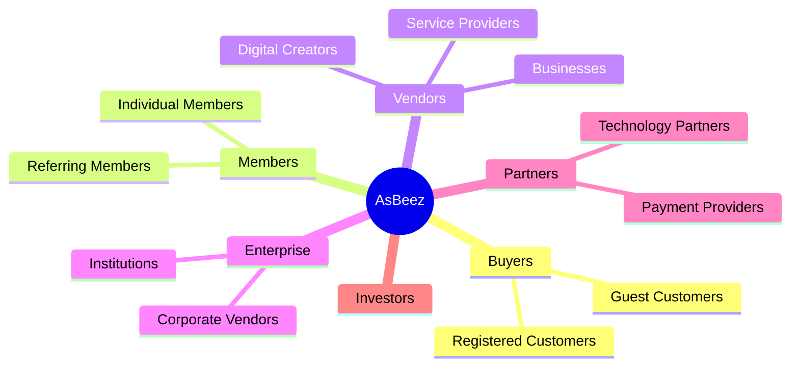
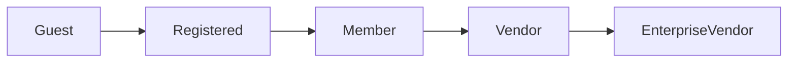

# Customer Segments

---

## Document Information

**Document ID:** AEDS-B02-008

**Version:** 1.0.0

**Status:** Draft

**Book:** 02 – The Business

**Classification:** Strategic Layer

**Owner:** Creator, Founder & Chief Architect

**Author:** Joey Lustre

---

# Purpose

This document defines the customer segments served by AsBeez.

Understanding customer segments allows the company to design better products, marketing strategies, software features, pricing models, support processes, and long-term growth strategies.

Every major feature developed within AsBeez should identify which customer segment it primarily serves.

---

# Customer-Centric Philosophy

AsBeez does not have one customer.

It serves multiple communities.

Each community has unique needs.

Each community creates different kinds of value.

The success of AsBeez depends on understanding and serving each segment exceptionally well.

---

# Primary Customer Segments

The AsBeez ecosystem currently consists of six primary customer segments.

---

# Segment 1 — Guest Customers

## Description

Visitors who purchase products without creating an account.

### Characteristics

- Fast checkout
- Convenience
- Low commitment
- No loyalty participation
- Primarily interested in products

### Goals

- Find products quickly.
- Complete purchases securely.
- Receive excellent service.

### Future Opportunity

Encourage Guest Customers to become registered Members by demonstrating the additional benefits of participating in the AsBeez ecosystem.

---

# Segment 2 — Registered Customers

These customers have accounts but are not yet active Members.

### Goals

- Easier future purchases
- Order history
- Saved payment methods
- Wishlist
- Product reviews

### Business Objective

Convert registered customers into active Members.

---

# Segment 3 — Members

Members are the heart of the Hive.

Membership is free.

Members participate in the loyalty ecosystem.

### Goals

- Purchase products
- Build ABCs
- Earn Reward Points
- Earn AsBeez Hive Credits according to platform rules
- Invite others
- Participate in community activities

### Long-Term Goal

Develop lifelong marketplace loyalty.

---

# Segment 4 — Vendors

Vendors supply the marketplace.

Sub-segments include:

## Digital Creators

- Authors
- Coaches
- Educators
- Software Developers
- Designers

---

## Professional Services

Future phase.

Examples:

- Lawyers
- Consultants
- Tutors
- Freelancers

---

## Retail Businesses

Future phase.

Examples:

- Manufacturers
- Retail Stores
- Local Businesses

---

## Enterprise Vendors

Large organizations with significant product catalogs.

Potential future capabilities:

- API integrations
- Bulk product imports
- Dedicated account managers
- Enterprise analytics

---

# Segment 5 — Strategic Partners

Organizations that strengthen the ecosystem.

Examples:

- Payment gateways
- Cloud providers
- Educational partners
- Financial institutions
- Logistics providers
- AI partners
- Government programs

---

# Segment 6 — Investors

Investors are long-term stakeholders.

They seek:

- Sustainable growth
- Strong governance
- Enterprise architecture
- Regulatory compliance
- Predictable scalability

AsBeez should communicate with investors through transparency and measurable business performance.

---

# Customer Evolution

One of the unique characteristics of AsBeez is that customers can evolve over time.

A single person may eventually become:

Customer

↓

Member

↓

Vendor

↓

Strategic Partner

This evolution strengthens long-term engagement.

---

# Customer Lifecycle Philosophy

Every interaction should move the customer toward greater trust.

Not every customer needs to become a Member.

Not every Member needs to become a Vendor.

But every participant should feel that AsBeez creates meaningful value for them.

---

# Segment Priorities

| Segment | Priority | Initial Launch |
|----------|----------|----------------|
| Guest Customers | High | ✅ |
| Registered Customers | High | ✅ |
| Members | Critical | ✅ |
| Digital Vendors | Critical | ✅ |
| Service Providers | Medium | Future |
| Enterprise Vendors | Medium | Future |
| Partners | Medium | Future |
| Investors | High | Ongoing |

---

# Open Decisions

The following items require future definition:

- Enterprise Vendor pricing.
- Institutional partnerships.
- Government programs.
- Educational marketplace.
- B2B marketplace.
- Wholesale marketplace.
- Marketplace franchise opportunities.
- Country-specific customer segmentation.

---

# Business Rules

1. Every customer segment must have a clearly defined value proposition.
2. Marketing campaigns should target specific segments.
3. Features should identify their primary customer segment.
4. Customer journeys should be optimized independently.
5. Segment analytics should be measured separately.
6. Customer privacy and data protection apply equally across all segments.
7. Segment definitions may evolve through governance approval.

---

# Success Metrics

Customer segmentation effectiveness should be evaluated through:

- Customer acquisition by segment
- Conversion from Guest to Member
- Conversion from Member to Vendor
- Customer lifetime value
- Retention by segment
- Revenue by segment
- Referral activity
- Net Promoter Score
- Customer satisfaction

---

# Summary

AsBeez serves multiple customer segments, each with different motivations and objectives.

By understanding these differences, AsBeez can build better products, create more effective marketing, strengthen customer loyalty, and design an ecosystem that grows sustainably.

Every customer matters.

Every journey is unique.

Every participant strengthens the Hive.

---

# Related Documents

- AEDS-B02-002 – Business Overview
- AEDS-B02-004 – The AsBeez Ecosystem
- AEDS-B02-005 – Stakeholders
- AEDS-B02-009 – Value Proposition
- Book 03 – Marketplace

---

# Revision History

| Version | Date | Description | Author |
|----------|------|-------------|--------|
|1.0.0|2026-07-07|Initial Customer Segments|

---

> **Every Purchase Builds the Hive.**
