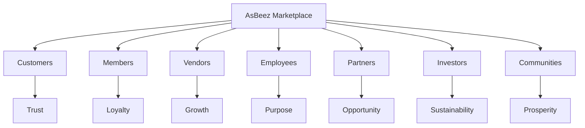

# Value Proposition

---

## Document Information

**Document ID:** AEDS-B02-009

**Version:** 1.0.0

**Status:** Draft

**Book:** 02 – The Business

**Classification:** Strategic Layer

**Owner:** Creator, Founder & Chief Architect

**Author:** Joey Lustre

---

# Purpose

This document defines the value propositions delivered by AsBeez to every stakeholder within the ecosystem.

A value proposition explains why a participant chooses AsBeez instead of another alternative.

Every feature, business process, policy, and technology investment should strengthen one or more of these value propositions.

---

# Core Value Proposition

> **AsBeez transforms ordinary online shopping into a community-powered commerce ecosystem where customers, members, vendors, partners, investors, and communities all benefit from genuine marketplace activity.**

Unlike traditional marketplaces that end the relationship at checkout, AsBeez is designed to build long-term relationships and create lasting value.

---

# Value Proposition Framework



---

# Customer Value Proposition

Customers choose AsBeez because it offers more than products.

Customers receive:

- Competitive marketplace
- Trusted vendors
- Secure payments
- Excellent shopping experience
- Digital convenience
- Future loyalty opportunities
- Transparent platform

Our promise:

> Shop with confidence.
Stay because you trust us.

---

# Member Value Proposition

Members become part of the Hive.

Benefits include:

- Reward Point accumulation
- ABC generation
- Participation in the Beehive Matrix according to platform rules
- Referral opportunities
- Wallet ecosystem
- Community participation
- Future member benefits

Our promise:

> Every qualifying purchase has the potential to create long-term value.

---

# Vendor Value Proposition

AsBeez helps vendors build businesses rather than simply listing products.

Every Vendor receives:

- Branded storefront
- Digital marketplace
- Product management
- Sales reports
- Promotions
- Coupons
- Customer insights
- Configurable revenue-sharing
- Loyal customer ecosystem

Future capabilities include:

- AI recommendations
- Vendor analytics
- Enterprise APIs
- Global marketplace expansion

Our promise:

> We succeed when our vendors succeed.

---

# Employee Value Proposition

Employees help build something meaningful.

They receive:

- Mission-driven culture
- Modern technology
- Career development
- Innovation opportunities
- Collaborative environment
- Long-term vision
- Enterprise architecture

Our promise:

> Build technology that improves lives.

---

# Partner Value Proposition

Partners receive:

- Business opportunities
- Platform integrations
- Shared growth
- Long-term relationships
- Enterprise collaboration

Examples include:

Payment Providers

Cloud Providers

AI Providers

Educational Partners

Financial Institutions

Marketing Partners

---

# Investor Value Proposition

Investors receive:

- Scalable business model
- Enterprise architecture
- Multiple revenue streams
- Global expansion strategy
- Community-powered growth
- Long-term sustainability

Our promise:

> Invest in an ecosystem designed for generations rather than quarters.

---

# Community Value Proposition

Communities benefit through:

- Entrepreneur opportunities
- Digital commerce
- Local business growth
- Economic activity
- Future charitable initiatives
- Education
- Innovation

A stronger Hive should strengthen the communities around it.

---

# Why Customers Choose AsBeez

```mermaid
mindmap
root((Why Choose AsBeez))

Shopping

Convenience

Trust

Selection

Vendors

Storefronts

Community

Members

Reward Points

ABC

AHC

Loyalty

Technology

Security

Innovation

Global

Countries

Currencies

Languages

Purpose

Build the Hive

Long-Term Value
```

---

# Value Proposition Comparison

| Stakeholder | Traditional Marketplace | AsBeez |
|--------------|------------------------|---------|
| Customer | Buy products | Build long-term participation |
| Vendor | Sell products | Build a loyal customer ecosystem |
| Member | Usually none | Participate in the Hive |
| Employee | Operate marketplace | Build meaningful technology |
| Partner | Integration | Strategic ecosystem participant |
| Investor | Marketplace growth | Community-powered enterprise |
| Community | Limited impact | Shared economic opportunity |

---

# Guiding Principles

Every new initiative should answer:

Does it improve customer value?

Does it strengthen vendor success?

Does it increase trust?

Does it simplify technology?

Does it strengthen community?

Does it strengthen the Hive?

If the answer is no, the initiative should be reconsidered.

---

# Open Decisions

Future value propositions under consideration:

- Vendor financing
- Business education platform
- Marketplace AI assistant
- International vendor expansion
- Charity marketplace
- Business incubation
- Financial products
- Insurance marketplace

---

# Success Metrics

Value proposition effectiveness will be measured by:

Customer Satisfaction

Vendor Satisfaction

Member Activation

Repeat Purchases

Referral Growth

Vendor Retention

Marketplace GMV

Customer Lifetime Value

Net Promoter Score

Marketplace Trust Index

---

# Summary

AsBeez creates value by connecting commerce, technology, loyalty, and community into one integrated ecosystem.

Every stakeholder receives value.

Every participant contributes value.

The stronger the ecosystem becomes, the more valuable it becomes for everyone.

---

# Related Documents

B02-003 Business Model

B02-004 Ecosystem

B02-005 Stakeholders

B02-006 Competitive Advantage

Book 03 Marketplace

---

# Revision History

| Version | Date | Description |
|----------|------|-------------|
|1.0.0|2026-07-07|Initial Value Proposition|

---

> **Every Purchase Builds the Hive.**