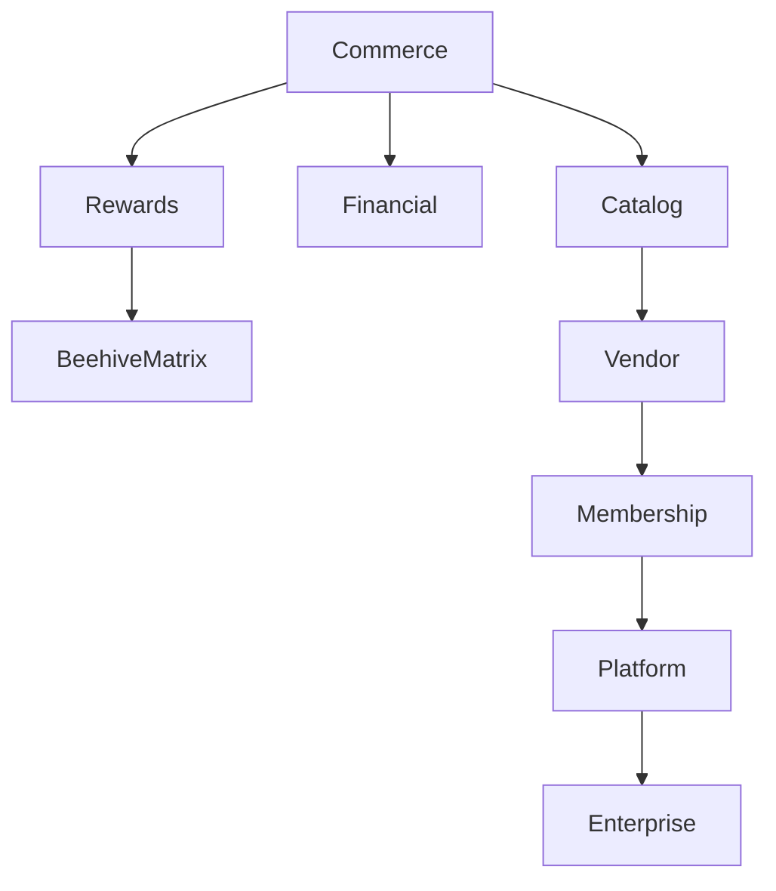

# Business Capabilities

---

## Document Information

**Document ID:** AEDS-B03-000

**Version:** 1.0.0

**Status:** Draft

**Book:** 03 – Business Capabilities

**Classification:** Enterprise Architecture

**Owner:** Creator, Founder & Chief Architect

**Author:** Joey Lustre

---

# Purpose

Business Capabilities define what AsBeez must be capable of doing to fulfill its mission.

A capability is independent of software, technology, programming language, or organizational structure.

Capabilities remain relatively stable over time even as applications, databases, APIs, and user interfaces evolve.

For AsBeez, Business Capabilities form the bridge between business strategy and software implementation.

---

# What is a Business Capability?

A Business Capability is an ability that the organization must possess in order to deliver value.

Examples include:

• Register Members

• Manage Vendors

• Process Orders

• Calculate Reward Points

• Generate ABCs

• Place ABCs in the Beehive Matrix

• Calculate AHC

• Process Withdrawals

• Manage Products

Notice these describe **abilities**, not software modules.

---

# Why Capabilities Matter

Capabilities provide a stable foundation for:

- Business planning
- Software architecture
- API design
- Database design
- Team organization
- Security
- Testing
- Documentation

Instead of organizing software around pages or menus, AsBeez will organize around business capabilities.

---

# Capability Hierarchy

```mermaid
graph TD

Business

-->Capabilities

Capabilities

-->Processes

Processes

-->Business Rules

Business Rules

-->Software Modules

Software Modules

-->Database

Software Modules

-->APIs

Software Modules

-->UI Screens

Software Modules

-->Reports
```

---

# Capability Domains

The initial capability map consists of the following domains.

## Commerce

Responsible for buying and selling.

---

## Membership

Responsible for members and referrals.

---

## Vendor

Responsible for vendors and storefronts.

---

## Catalog

Responsible for products.

---

## Rewards

Responsible for RP, ABC and AHC.

---

## Beehive Matrix

Responsible for placement and distributions.

---

## Financial

Responsible for money movement.

---

## Platform

Responsible for configuration and system management.

---

## Enterprise

Responsible for governance, compliance and monitoring.

---

# Guiding Principles

Business Capabilities should:

- Represent business abilities.
- Remain stable over time.
- Be technology independent.
- Be reusable.
- Support enterprise scalability.
- Be traceable.

---

# Capability Relationships



---

# Related Documents

Book 02 – Business

Book 04 – Marketplace

Book 05 – Membership

Book 06 – Vendors

Book 10 – Technology

---

> Every Purchase Builds the Hive.